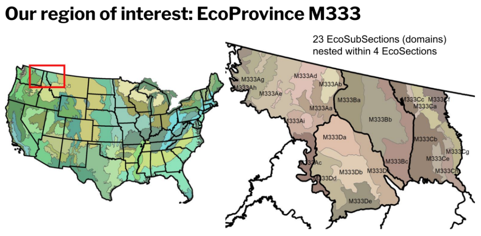

<style>
body {
  color: black;
  font-family: Calibri;
  background-color: #B0C4DE;
}
pre {
  color: black;
  background-color: #B0C4DE;
}
</style>


```{r setup, include=FALSE}

library(ggbeeswarm)
library(shinyWidgets)
library(plotly)

# for Mapping page
library(sf)
library(dplyr)
library(leaflet)
library(RColorBrewer)
library(htmltools)
library(htmlwidgets)

```

```{r, include = FALSE}

load("./app-data/app_data.RData")

simpop_first100reps_Mar2023Data <- read.csv("./app-data/simpop_first100reps_Mar2023Data.csv")
simpop_first100reps_Mar2023Data["tnt"][simpop_first100reps_Mar2023Data["tnt"] == 1] <- 0
simpop_first100reps_Mar2023Data["tnt"][simpop_first100reps_Mar2023Data["tnt"] == 2] <- 1
simpop_first100reps_Mar2023Data$tnt <- as.factor(simpop_first100reps_Mar2023Data$tnt)

subsecMeans_Mar2023Data <- read.csv("./app-data/subsecMeans_Mar2023Data.csv")

# create general theme for following plots
zwcody23_theme <-  theme(panel.background = element_rect(fill = "white", colour = "grey15"),
        text = element_text(size = 14, family = "Sans Serif", color = "black"),
        axis.text = element_text(size = 10, family = "Serif", colour = "black"),
        axis.title.x = element_text(size = 12, family = "Serif", colour = "black"),
        axis.title.y = element_text(size = 12, family = "Serif", colour = "black"),
        legend.title = element_text(size = 14, family = "Serif", colour = "black"),
        legend.key.size = unit(0.1, 'in'),
        legend.text = element_text(size = 10, family = "Serif", colour = "black"))

y_vars_list <- list("Live basal area (sqft/acre)"  = "BA_MEAN",
                            "Aboveground dry biomass (tons/acre)" = "DRYBIO_MEAN",
                            "Board-foot (volume/acre)" = "VOLBFNET_MEAN",
                            "Cubic-foot (volume/acre)" = "VOLCFNET_MEAN",
                            "Number of live trees (per-acre)" = "COUNT_MEAN",
                           "Carbon" = "CARBON_MEAN")

y_vars_list_2 <- list("Live basal area (sqft/acre)"  = "BA",
                            "Aboveground dry biomass (tons/acre)" = "DRYBIO",
                            "Board-foot (volume/acre)" = "VOLBFNET",
                            "Cubic-foot (volume/acre)" = "VOLCFNET",
                            "Number of live trees (per-acre)" = "COUNT",
                           "Carbon" = "CARBON")


x_vars_list <- list("TMndvi"  = "TMndvi",
                            "TMevi" = "TMevi",
                            "Tcc16" = "tcc16",
                            "Elevation" = "elev",
                            "Roughness" = "roughness",
                            "Tri" = "tri",
                             "Tpi" = "tpi",
                    "Ppt" = "ppt",
                    "Tmean" = "tmean",
                    "Tmax" = "tmax",
                    "Tmin" = "tmin",
                    "Vpdmax" = "vpdmax",
                    "Def" = "def",
                    "Tdmean" = "tdmean"
                            )


# for Mapping page:
#loading the eco subsections shapefile for mapping purposes  
eco.sf <- st_read("./app-data/S_USA.EcomapSubsections.shp")
# creating and appending a new column to the dataset that accounts for section values
estim.data1 <- subsecMeans_simpop_estm
section <- substring(estim.data1$SUBSECTION, 5,5)
estim.data1$section <- section

```

Welcome 
==================================================

Row 
--------------------------------------------------
                                              
```{r out.width = '100%', out.height='100%'}

```

Overview
==================================================

Row
--------------------------------------------------

###
```{r out.width ='100%', out.height='100%'} 

```

### ***The Data*** 
The Forest and Analysis Program, or FIA, is a branch of the US Forest Service dedicated to keeping a comprehensive and up-to-date inventory of US forest resources. The FIA conducts a survey sampling approach to gather the data necessary for this project. The FIA ensures an equal distribution of survey locations across the country by partitioning the entire US into ~6000-acre hexagons and randomly choosing one location per hexagon as a permanent sample plot. At each sample plot, FIA field crews collect data on forest attributes to measure different aspects of forest health. Additionally, the entire sampled area is partitioned into domains, and different geological features and forest types determine each domain's border and size. Our research narrows the scope to 23 domains, and the image to the left depicts our domains' location and borders.

Row
--------------------------------------------------
### ***The Mapping*** 

The map was created using the Leaflet software to create a visual of the 23 domains. The shapefiles were taken from USDA Forest Service’s Ecological Subsections data. With the map, the user can select the variable and estimator they want represented visually and the map subsections will be colored according to the appropriate estimates. Each variable has a different color theme to make them distinctive on the map. The different “reps” of the artificial population can then be viewed by clicking on the play button which will then animate the 100 reps. Every subsection is also colored by their respective section, which is a broader grouping of the ecological units. When hovering over a specific subsection, the user can view exact estimates as well as the section name. The map is helpful to visualize estimates between different variables, estimators, and reps. 


Row 
--------------------------------------------------
### ***Our Contributions***

The app currently compares two simple estimators and a small-area model based on linear regression. The simple estimators are derived by taking the direct and post-stratified averages of six variables. The variable used for post-stratification is categorical and represents whether a satellite pixel is predicted to contain trees. The explanatory variables used for each linear regression are detailed in the 'About' section. While there are many small area estimation models, the one used here is a unit-level model called the Battese-Harter-Fuller model. Each model is fit to many "reps" of simulated samples from a pre-made artificial population. Each "rep" of the artificial population is a sample from the artificial population created using auxiliary satellite data and a k-nearest-neighbors approach. The artificial population allows us to see the distribution of estimates across many reps. The goal is to find a model that works well across many reps of the artificial population because that model is likely to be a good fit for the actual sample data. The app showcases estimates derived from the three estimators for the first 100 reps of the artificial population. The first page displays the distribution of estimates across reps and allows users to select the domains they wish to compare. The user can also select to view the relative bias, ratio of mean squared errors, and confidence interval coverage of an estimate. The population means for the entire simulated population are also included so that comparisons to the distribution of estimates for the first 100 reps of the simulated population can be made across estimators. The second page allows the user to compare the distribution of each estimate across estimators for the same domain. The app is a tool used to ensure estimates get created correctly. Additionally, the app makes it easy to compare models across domains to determine whether a particular model struggles with a domain or if a single model performs best across all domains. Visualizing this information will help us continue to create more accurate models.

Row 
--------------------------------------------------
### ***Future Goals***

The goal is to continue refining existing models while also creating new models until we find one that works well across all repetitions in the artificial population. If a model can achieve this in the simulated data, it will likely be a good fit for the sample data. Eventually, we want to fit that model to the sample data, not the auxiliary data. The end goal is to use this final model to make predictions for each pixel in the auxiliary data, allowing us to generate domain-level summary statistics that are more accurate than the summary statistics derived from the sampled data. The ongoing project will eventually increase forest attribute estimates at the domain level to better inform the FIA on forest health metrics.


Mapping
==========

Inputs {.sidebar}
------------------------------------------------


```{r map-inputs}

#this sections creates each of the slider inputs! If you create additional user inputs,
#make sure to name then differently from the ones used above to avoid errors within shiny

#this slider lets you select the variable you would like to map
selectInput("var1", label = "Which variable do you want to map?",
            choices = y_vars_list,
            selected = "BA_MEAN")

#this slider lets you select the estimator you would like to map
selectInput("pred23", label = "Which Estimator do you want?",
            choices = c("Direct Average Estimator" = "Direct Average Estimator",
                        "Post-Stratified Estimator" = "Post-Stratified Estimator",
                        "Small Area Estimator" = "Small Area Estimator"),
            selected = "Direct Average Estimator")


sliderInput("Rep", label = "Replication Number",
            min = 1,
            max = 100,
            value = 1,
            step = 1,
            animate = animationOptions(loop = FALSE))


```

row {.tabset}
-----------------------------------------------------------------------


```{r map-outputs}

#not reactive section
estim.data3 <- estim.data1  %>%
  filter(rep == 1, ESTIMATOR == "Direct Average Estimator") %>%
  left_join(eco.sf, by=c("SUBSECTION" = "MAP_UNIT_S")) %>%
  sf::st_as_sf() %>%
  sf::st_transform('+proj=longlat +datum=WGS84')

forestcols3 <- brewer.pal(9, "Blues")[3:9]
#domain is the possible values that can be mapped and is this case
#would be all of the values from the original data set for that y variable, since this
#will cover all of the possible values that could be mapped and will result in a legend
#that won't change
#This is why I use the original dataset here and not the reactive data set
pal3 <- colorBin(forestcols3, domain = estim.data1$BA_MEAN)


#in this section, I will create several reactive elements that will modify paramters
#prior to mapping and then I will map the data using leaflet!


#######Filtering the data first
# creating a reactive element that will filter the dataset when any one element is changed
# by the user. The dataset that is returned will be used throughout the program!!
estim.data <- eventReactive({c(input$pred23, input$Rep, input$var1)}, {
    estim.data <- estim.data1 %>% #original data set from Jerzy
      filter(rep == input$Rep, ESTIMATOR == input$pred23) %>% #filtering by the selected         estimator and rep number
      left_join(eco.sf, by=c("SUBSECTION" = "MAP_UNIT_S")) %>% #joining with the spatial         data
      sf::st_as_sf() %>% #you need to re-orient the object (not really sure why)
      sf::st_transform('+proj=longlat +datum=WGS84') #fixes the error message about the         projection
    return(estim.data) #returning the final filtered data set
  })


palfinder2 <- eventReactive(input$var1, {
      color1 <- brewer.pal(n = 4, name ="Dark2")
      pal1 <- colorFactor(color1, domain = estim.data()$section)
      return(pal1)
  })

#creating different colors for when the user changes the y-variable
color_list = c("Blues", "Greens", "Oranges", "Reds", "Purples", "YlGn")

#this reactive element is activated when the user changes the y-variable and results in the color palette being changed
palFinder <- eventReactive(input$var1, {
      color <- color_list[match(input$var1, y_vars_list)]
      #assigning the color palette using the color finder function from above
      #the [3:9] indexes it so that it starts out with darker beginning colors
      forestcols <- brewer.pal(9, color)[3:9]
      #domain is the possible values that can be mapped and is this case
      #would be all of the values from the original data set for that y variable, since this 
      #will cover all of the possible values that could be mapped and will result in a legend
      #that won't change
      #This is why I use the original dataset here and not the reactive data set
      pal <- colorBin(forestcols, domain = subsecMeans_simpop_estm[[input$var1]])
      return(pal)
  })


labelsinitial <- sprintf(
  "<strong>Live Basal Area: %s  </strong><br/>Subsection: %s<br/>Section: %s", round(estim.data3$BA_MEAN,2), estim.data3$SUBSECTION, estim.data3$section
) %>% lapply(htmltools::HTML)

#now creating the base output map object with provider tiles that
#will not change with each new update
output$map <- renderLeaflet({
  #Now making the leaflet part ;)
  leaflet(data=estim.data3) %>%
    addProviderTiles("Esri.WorldGrayCanvas") %>% #adding the background tiles
    fitBounds(lng1 = -125, lng2 = -110,
                      lat1 = 44, lat2 = 50) %>%
    addPolygons(color = ~palfinder2()(section), opacity=5, stroke = TRUE, fillOpacity = 0, weight=2) %>%
    addPolygons(fillColor = ~pal3(estim.data3$BA_MEAN),
                weight = 2,
                opacity = 0.01,
                fillOpacity = 0.5,
                label=labelsinitial, #adds the labels created above (with rollover capability)
                labelOptions = labelOptions(
                  style = list("font-weight" = "normal", padding = "3px 8px"),
                  textsize = "15px",
                  direction = "auto"))%>%
        addLegend("bottomleft", pal = palFinder(),
              values =estim.data3$BA_MEAN, title="Live Basal Area") %>%
    addLegend("bottomleft", pal = palfinder2(),
              values =section,
            title = "section")

})


#changing the color pallet with the changing y variable and mapping
#these new color tiles. At this observe event, we also add the legend
#which will stay the same for each y-variable

observeEvent(input$var1, {
  leafletProxy("map", data = estim.data()) %>%
    clearControls() %>%
      #adds the legend
    addLegend("bottomleft", pal = palFinder(),
              values = subsecMeans_simpop_estm[[input$var1]],
            title = names(y_vars_list)[which(y_vars_list == input$var1)]) %>%
    addLegend("bottomleft", pal = palfinder2(),
              values = section,
            title = "section")

})

#this will change the polygons and labels each time that either the rep, the
#estimator or the y-var is change
observeEvent(ignoreNULL = F, ignoreInit = T, c(input$Rep,  input$pred23, input$var1), {

labels <- sprintf(
  "<strong>%s: </strong><strong>%s</strong><br/>Subsection: %s<br/>Section: %s",  names(y_vars_list)[which(y_vars_list == input$var1)], round(estim.data()[[input$var1]],2), estim.data()$SUBSECTION, estim.data()$section
) %>% lapply(htmltools::HTML)


leafletProxy("map", data = estim.data()) %>%
    addPolygons(fillColor = ~palFinder()(estim.data()[[input$var1]]),
                weight = 2,
                opacity = .001,
                fillOpacity = 0.5,
                highlightOptions = highlightOptions(
                  weight = 1,
                  fillOpacity = 0.04,
                  bringToFront = T), #adds the polygons
                label=labels, #adds the labels created above (with rollover capability)
                labelOptions = labelOptions(
                  style = list("font-weight" = "normal", padding = "3px 8px"),
                  textsize = "15px",
                  direction = "auto"))  %>%
  addPolygons(color = ~palfinder2()(section), opacity=5, stroke = TRUE, fillOpacity = 0, weight=2,
              highlightOptions = highlightOptions(
                  weight = 1,
                  fillOpacity = 0.01,
                  bringToFront = T), #adds the polygons
                label=labels, #adds the labels created above (with rollover capability)
                labelOptions = labelOptions(
                  style = list("font-weight" = "normal", padding = "3px 8px"),
                  textsize = "15px",
                  direction = "auto"))
})


# fillpage() which is part of shiny, will make it so that the map fills the entire page not just the upper half
#fillPage(leafletOutput("map", width = "100%", height = "100%"))
# ...but I'm commenting out fillPage()
# because (for some reason) this wrecks the "cerulean" theme for entire Shiny app
# and the map still looks fine without it
leafletOutput("map", width = "100%", height = "100%")

```


Compare Domains
==================================================

Inputs {.sidebar}
------------------------------------------------

```{r}

pickerInput("prov",
            label = "Select Domain",
            choices = unique(subsecMeans_simpop_estm$SUBSECTION),
            selected = unique(subsecMeans_simpop_estm$SUBSECTION)[[1]],
            options = list(`actions-box` = TRUE,
                            size = 10,
                            `selected-text-format` = "count > 3"),
          multiple = TRUE)

selectInput("attr", label = "Which variable do you want to map?",
            choices = y_vars_list,
                    selected = "BA_MEAN")

selectInput("pred", label = "Which predictor do you want to use?",
            choices = list("Direct Average Predictor" = "avg",
                           "Post-Stratified Means" = "ps",
            "Small Area Estimator" = "sae"))

selectInput("sort", label = "Sort?",
            choices = list("Alphabetical" = "none",
                           "Mean (low to high)" = "mean",
                           "Domain size (small to large)" = "size"))

```


row {.tabset}
-----------------------------------------------------------------------

### By Estimate

```{r out.width="90%"}

# Boxplot version
output$estimates <- renderPlotly({
  
    estimates <- ggplot(subset(subsecMeans_simpop_estm[subsecMeans_simpop_estm$ESTIMATOR == "Direct Average Estimator", ], SUBSECTION %in% input$prov), aes_string(x="SUBSECTION", y= input$attr)) +
  geom_boxplot(fill = "#B0C4DE") +
  geom_point(data = subset(subsecMeans_Mar2023Data, SUBSECTION %in% input$prov), aes(color = "Simulated Population Mean\n(All Reps)")) +
  zwcody23_theme +
  labs(title = "Distribution of Direct Average Estimates Across Domains",
       x = "Subsection",
       y = names(y_vars_list)[which(y_vars_list == input$attr)]) +
  theme(axis.text.x = element_text(angle = 45, vjust = 0.5)) + 
    scale_color_manual(name='   Legend',
                     breaks=c("Rep Estimate", 'Simulated Population Mean\n(All Reps)'),
                     values=c("Rep Estimate" = "black", 'Simulated Population Mean\n(All Reps)'='red'))
  
  predictor <- paste(input$pred)
  sorter <- paste(input$sort)
  if (predictor == 'avg' & sorter == "size")
    
    estimates <- ggplot(subset(subsecMeans_simpop_estm_order[subsecMeans_simpop_estm_order$ESTIMATOR == "Direct Average Estimator", ], SUBSECTION %in% input$prov), aes_string(x="SUBSECTION", y= input$attr)) +
  geom_boxplot(fill = "#B0C4DE") + 
  geom_point(data = subset(subsecMeans_Mar2023Data, SUBSECTION %in% input$prov), aes(color = "Simulated Population Mean\n(All Reps)")) +
  zwcody23_theme +
  labs(title = "Distribution of Direct Average Estimates Across Domains",
       x = "Subsection",
       y = names(y_vars_list)[which(y_vars_list == input$attr)]) +
  theme(axis.text.x = element_text(angle = 45, vjust = 0.5)) + 
    scale_color_manual(name='   Legend',
                     breaks=c("Rep Estimate", 'Simulated Population Mean\n(All Reps)'),
                     values=c("Rep Estimate" = "black", 'Simulated Population Mean\n(All Reps)'='red'))
  
  predictor <- paste(input$pred)
  sorter <- paste(input$sort)
  if (predictor == 'avg' & sorter == "mean")
    
    estimates <- ggplot(subset(subsecMeans_simpop_estm_ba[subsecMeans_simpop_estm_ba$ESTIMATOR == "Direct Average Estimator", ], SUBSECTION %in% input$prov), aes_string(x="SUBSECTION", y= input$attr)) +
  geom_boxplot(fill = "#B0C4DE") + 
  geom_point(data = subset(subsecMeans_Mar2023Data, SUBSECTION %in% input$prov), aes(color = "Simulated Population Mean\n(All Reps)")) +
  zwcody23_theme +
  labs(title = "Distribution of Direct Average Estimates Across Domains",
       x = "Subsection",
       y = names(y_vars_list)[which(y_vars_list == input$attr)]) +
  theme(axis.text.x = element_text(angle = 45, vjust = 0.5)) + 
    scale_color_manual(name='   Legend',
                     breaks=c("Rep Estimate", 'Simulated Population Mean\n(All Reps)'),
                     values=c("Rep Estimate" = "black", 'Simulated Population Mean\n(All Reps)'='red'))
  
  predictor <- paste(input$pred)
  sorter <- paste(input$sort)
  var <- paste(input$attr)
  if (predictor == 'avg' & sorter == "mean" & var == "DRYBIO_MEAN")
    
    estimates <- ggplot(subset(subsecMeans_simpop_estm_drybio[subsecMeans_simpop_estm_drybio$ESTIMATOR == "Direct Average Estimator", ], SUBSECTION %in% input$prov), aes_string(x="SUBSECTION", y= input$attr)) +
  geom_boxplot(fill = "#B0C4DE") +
  geom_point(data = subset(subsecMeans_Mar2023Data, SUBSECTION %in% input$prov), aes(color = "Simulated Population Mean\n(All Reps)")) +
  zwcody23_theme +
  labs(title = "Distribution of Direct Average Estimates Across Domains",
       x = "Subsection",
       y = names(y_vars_list)[which(y_vars_list == input$attr)]) +
  theme(axis.text.x = element_text(angle = 45, vjust = 0.5)) + 
    scale_color_manual(name='   Legend',
                     breaks=c("Rep Estimate", 'Simulated Population Mean\n(All Reps)'),
                     values=c("Rep Estimate" = "black", 'Simulated Population Mean\n(All Reps)'='red'))
  
  predictor <- paste(input$pred)
  sorter <- paste(input$sort)
  var <- paste(input$attr)
  if (predictor == 'avg' & sorter == "mean" & var == "VOLBFNET_MEAN")
    
    estimates <- ggplot(subset(subsecMeans_simpop_estm_volbfnet[subsecMeans_simpop_estm_volbfnet$ESTIMATOR == "Direct Average Estimator", ], SUBSECTION %in% input$prov), aes_string(x="SUBSECTION", y= input$attr)) +
  geom_boxplot(fill = "#B0C4DE") +
  geom_point(data = subset(subsecMeans_Mar2023Data, SUBSECTION %in% input$prov), aes(color = "Simulated Population Mean\n(All Reps)")) +
  zwcody23_theme +
  labs(title = "Distribution of Direct Average Estimates Across Domains",
       x = "Subsection",
       y = names(y_vars_list)[which(y_vars_list == input$attr)]) +
  theme(axis.text.x = element_text(angle = 45, vjust = 0.5)) + 
    scale_color_manual(name='   Legend',
                     breaks=c("Rep Estimate", 'Simulated Population Mean\n(All Reps)'),
                     values=c("Rep Estimate" = "black", 'Simulated Population Mean\n(All Reps)'='red'))
  
  predictor <- paste(input$pred)
  sorter <- paste(input$sort)
  var <- paste(input$attr)
  if (predictor == 'avg' & sorter == "mean" & var == "VOLCFNET_MEAN")
    
    estimates <- ggplot(subset(subsecMeans_simpop_estm_volcfnet[subsecMeans_simpop_estm_volcfnet$ESTIMATOR == "Direct Average Estimator", ], SUBSECTION %in% input$prov), aes_string(x="SUBSECTION", y= input$attr)) +
  geom_boxplot(fill = "#B0C4DE") +
  geom_point(data = subset(subsecMeans_Mar2023Data, SUBSECTION %in% input$prov), aes(color = "Simulated Population Mean\n(All Reps)")) +
  zwcody23_theme +
  labs(title = "Distribution of Direct Average Estimates Across Domains",
       x = "Subsection",
       y = names(y_vars_list)[which(y_vars_list == input$attr)]) +
  theme(axis.text.x = element_text(angle = 45, vjust = 0.5)) + 
    scale_color_manual(name='   Legend',
                     breaks=c("Rep Estimate", 'Simulated Population Mean\n(All Reps)'),
                     values=c("Rep Estimate" = "black", 'Simulated Population Mean\n(All Reps)'='red'))
  
  predictor <- paste(input$pred)
  sorter <- paste(input$sort)
  var <- paste(input$attr)
  if (predictor == 'avg' & sorter == "mean" & var == "COUNT_MEAN")
    
    estimates <- ggplot(subset(subsecMeans_simpop_estm_count[subsecMeans_simpop_estm_count$ESTIMATOR == "Direct Average Estimator", ], SUBSECTION %in% input$prov), aes_string(x="SUBSECTION", y= input$attr)) +
  geom_boxplot(fill = "#B0C4DE") +
  geom_point(data = subset(subsecMeans_Mar2023Data, SUBSECTION %in% input$prov), aes(color = "Simulated Population Mean\n(All Reps)")) +
  zwcody23_theme +
  labs(title = "Distribution of Direct Average Estimates Across Domains",
       x = "Subsection",
       y = names(y_vars_list)[which(y_vars_list == input$attr)]) +
  theme(axis.text.x = element_text(angle = 45, vjust = 0.5)) + 
    scale_color_manual(name='   Legend',
                     breaks=c("Rep Estimate", 'Simulated Population Mean\n(All Reps)'),
                     values=c("Rep Estimate" = "black", 'Simulated Population Mean\n(All Reps)'='red'))
  
  predictor <- paste(input$pred)
  sorter <- paste(input$sort)
  var <- paste(input$attr)
  if (predictor == 'avg' & sorter == "mean" & var == "CARBON_MEAN")
    
    estimates <- ggplot(subset(subsecMeans_simpop_estm_carbon[subsecMeans_simpop_estm_carbon$ESTIMATOR == "Direct Average Estimator", ], SUBSECTION %in% input$prov), aes_string(x="SUBSECTION", y= input$attr)) +
  geom_boxplot(fill = "#B0C4DE") +
  geom_point(data = subset(subsecMeans_Mar2023Data, SUBSECTION %in% input$prov), aes(color = "Simulated Population Mean\n(All Reps)")) +
  zwcody23_theme +
  labs(title = "Distribution of Direct Average Estimates Across Domains",
       x = "Subsection",
       y = names(y_vars_list)[which(y_vars_list == input$attr)]) +
  theme(axis.text.x = element_text(angle = 45, vjust = 0.5)) + 
    scale_color_manual(name='   Legend',
                     breaks=c("Rep Estimate", 'Simulated Population Mean\n(All Reps)'),
                     values=c("Rep Estimate" = "black", 'Simulated Population Mean\n(All Reps)'='red'))

  predictor <- paste(input$pred)
  sorter <- paste(input$sort)
  if (predictor == 'ps' & sorter == "none")
  
    estimates <- ggplot(subset(subsecMeans_simpop_estm[subsecMeans_simpop_estm$ESTIMATOR == "Post-Stratified Estimator", ], SUBSECTION %in% input$prov), aes_string(x= "SUBSECTION", y= input$attr)) + 
  geom_boxplot(fill = "#B0C4DE") +
  geom_point(data = subset(subsecMeans_Mar2023Data, SUBSECTION %in% input$prov), aes(color = "Simulated Population Mean\n(All Reps)")) +
  zwcody23_theme +
  labs(title = "Distribution of Post-Stratified Estimates Across Domains",
       x = "Subsection",
       y = names(y_vars_list)[which(y_vars_list == input$attr)]) +
  theme(axis.text.x = element_text(angle = 45, vjust = 0.5)) + 
    scale_color_manual(name='   Legend',
                     breaks=c("Rep Estimate", 'Simulated Population Mean\n(All Reps)'),
                     values=c("Rep Estimate" = "black", 'Simulated Population Mean\n(All Reps)'='red')) + 
    scale_color_manual(name='   Legend',
                     breaks=c("Rep Estimate", 'Simulated Population Mean\n(All Reps)'),
                     values=c("Rep Estimate" = "black", 'Simulated Population Mean\n(All Reps)'='red'))
  
  predictor <- paste(input$pred)
  sorter <- paste(input$sort)
  if (predictor == 'ps' & sorter == "size")
    
    estimates <- ggplot(subset(subsecMeans_simpop_estm_order[subsecMeans_simpop_estm_order$ESTIMATOR == "Post-Stratified Estimator", ], SUBSECTION %in% input$prov), aes_string(x= "SUBSECTION", y= input$attr)) + 
  geom_boxplot(fill = "#B0C4DE") +
  geom_point(data = subset(subsecMeans_Mar2023Data, SUBSECTION %in% input$prov), aes(color = "Simulated Population Mean\n(All Reps)")) +
  zwcody23_theme +
  labs(title = "Distribution of Post-Stratified Estimates Across Domains",
       x = "Subsection",
       y = names(y_vars_list)[which(y_vars_list == input$attr)]) +
  theme(axis.text.x = element_text(angle = 45, vjust = 0.5)) + 
    scale_color_manual(name='   Legend',
                     breaks=c("Rep Estimate", 'Simulated Population Mean\n(All Reps)'),
                     values=c("Rep Estimate" = "black", 'Simulated Population Mean\n(All Reps)'='red'))
  
  predictor <- paste(input$pred)
  sorter <- paste(input$sort)
  if (predictor == 'ps' & sorter == "mean")
    
    estimates <- ggplot(subset(subsecMeans_simpop_estm_ba[subsecMeans_simpop_estm_ba$ESTIMATOR == "Post-Stratified Estimator", ], SUBSECTION %in% input$prov), aes_string(x= "SUBSECTION", y= input$attr)) + 
  geom_boxplot(fill = "#B0C4DE") +
  geom_point(data = subset(subsecMeans_Mar2023Data, SUBSECTION %in% input$prov), aes(color = "Simulated Population Mean\n(All Reps)")) +
  zwcody23_theme +
  labs(title = "Distribution of Post-Stratified Estimates Across Domains",
       x = "Subsection",
       y = names(y_vars_list)[which(y_vars_list == input$attr)]) +
  theme(axis.text.x = element_text(angle = 45, vjust = 0.5)) + 
    scale_color_manual(name='   Legend',
                     breaks=c("Rep Estimate", 'Simulated Population Mean\n(All Reps)'),
                     values=c("Rep Estimate" = "black", 'Simulated Population Mean\n(All Reps)'='red'))
  
  predictor <- paste(input$pred)
  sorter <- paste(input$sort)
  var <- paste(input$attr)
  if (predictor == 'ps' & sorter == "mean" & var == "DRYBIO_MEAN")
    
    estimates <- ggplot(subset(subsecMeans_simpop_estm_drybio[subsecMeans_simpop_estm_drybio$ESTIMATOR == "Post-Stratified Estimator", ], SUBSECTION %in% input$prov), aes_string(x= "SUBSECTION", y= input$attr)) + 
  geom_boxplot(fill = "#B0C4DE") +
  geom_point(data = subset(subsecMeans_Mar2023Data, SUBSECTION %in% input$prov), aes(color = "Simulated Population Mean\n(All Reps)")) +
  zwcody23_theme +
  labs(title = "Distribution of Post-Stratified Estimates Across Domains",
       x = "Subsection",
       y = names(y_vars_list)[which(y_vars_list == input$attr)]) +
  theme(axis.text.x = element_text(angle = 45, vjust = 0.5)) + 
    scale_color_manual(name='   Legend',
                     breaks=c("Rep Estimate", 'Simulated Population Mean\n(All Reps)'),
                     values=c("Rep Estimate" = "black", 'Simulated Population Mean\n(All Reps)'='red'))
  
  predictor <- paste(input$pred)
  sorter <- paste(input$sort)
  var <- paste(input$attr)
  if (predictor == 'ps' & sorter == "mean" & var == "VOLBFNET_MEAN")
    
    estimates <- ggplot(subset(subsecMeans_simpop_estm_volbfnet[subsecMeans_simpop_estm_volbfnet$ESTIMATOR == "Post-Stratified Estimator", ], SUBSECTION %in% input$prov), aes_string(x= "SUBSECTION", y= input$attr)) + 
  geom_boxplot(fill = "#B0C4DE") +
  geom_point(data = subset(subsecMeans_Mar2023Data, SUBSECTION %in% input$prov), aes(color = "Simulated Population Mean\n(All Reps)")) +
  zwcody23_theme +
  labs(title = "Distribution of Post-Stratified Estimates Across Domains",
       x = "Subsection",
       y = names(y_vars_list)[which(y_vars_list == input$attr)]) +
  theme(axis.text.x = element_text(angle = 45, vjust = 0.5)) + 
    scale_color_manual(name='   Legend',
                     breaks=c("Rep Estimate", 'Simulated Population Mean\n(All Reps)'),
                     values=c("Rep Estimate" = "black", 'Simulated Population Mean\n(All Reps)'='red'))
  
  predictor <- paste(input$pred)
  sorter <- paste(input$sort)
  var <- paste(input$attr)
  if (predictor == 'ps' & sorter == "mean" & var == "VOLCFNET_MEAN")
    
    estimates <- ggplot(subset(subsecMeans_simpop_estm_volcfnet[subsecMeans_simpop_estm_volcfnet$ESTIMATOR == "Post-Stratified Estimator", ], SUBSECTION %in% input$prov), aes_string(x= "SUBSECTION", y= input$attr)) + 
  geom_boxplot(fill = "#B0C4DE") + 
  geom_point(data = subset(subsecMeans_Mar2023Data, SUBSECTION %in% input$prov), aes(color = "Simulated Population Mean\n(All Reps)")) +
  zwcody23_theme +
  labs(title = "Distribution of Post-Stratified Estimates Across Domains",
       x = "Subsection",
       y = names(y_vars_list)[which(y_vars_list == input$attr)]) +
  theme(axis.text.x = element_text(angle = 45, vjust = 0.5)) + 
    scale_color_manual(name='   Legend',
                     breaks=c("Rep Estimate", 'Simulated Population Mean\n(All Reps)'),
                     values=c("Rep Estimate" = "black", 'Simulated Population Mean\n(All Reps)'='red'))
  
  predictor <- paste(input$pred)
  sorter <- paste(input$sort)
  var <- paste(input$attr)
  if (predictor == 'ps' & sorter == "mean" & var == "COUNT_MEAN")
    
    estimates <- ggplot(subset(subsecMeans_simpop_estm_count[subsecMeans_simpop_estm_count$ESTIMATOR == "Post-Stratified Estimator", ], SUBSECTION %in% input$prov), aes_string(x= "SUBSECTION", y= input$attr)) + 
  geom_boxplot(fill = "#B0C4DE") +
  geom_point(data = subset(subsecMeans_Mar2023Data, SUBSECTION %in% input$prov), aes(color = "Simulated Population Mean\n(All Reps)")) +
  zwcody23_theme +
  labs(title = "Distribution of Post-Stratified Estimates Across Domains",
       x = "Subsection",
       y = names(y_vars_list)[which(y_vars_list == input$attr)]) +
  theme(axis.text.x = element_text(angle = 45, vjust = 0.5)) + 
    scale_color_manual(name='   Legend',
                     breaks=c("Rep Estimate", 'Simulated Population Mean\n(All Reps)'),
                     values=c("Rep Estimate" = "black", 'Simulated Population Mean\n(All Reps)'='red'))
  
  predictor <- paste(input$pred)
  sorter <- paste(input$sort)
  var <- paste(input$attr)
  if (predictor == 'ps' & sorter == "mean" & var == "CARBON_MEAN")
    
    estimates <- ggplot(subset(subsecMeans_simpop_estm_carbon[subsecMeans_simpop_estm_carbon$ESTIMATOR == "Post-Stratified Estimator", ], SUBSECTION %in% input$prov), aes_string(x= "SUBSECTION", y= input$attr)) + 
  geom_boxplot(fill = "#B0C4DE") +
  geom_point(data = subset(subsecMeans_Mar2023Data, SUBSECTION %in% input$prov), aes(color = "Simulated Population Mean\n(All Reps)")) +
  zwcody23_theme +
  labs(title = "Distribution of Post-Stratified Estimates Across Domains",
       x = "Subsection",
       y = names(y_vars_list)[which(y_vars_list == input$attr)]) +
  theme(axis.text.x = element_text(angle = 45, vjust = 0.5)) + 
    scale_color_manual(name='   Legend',
                     breaks=c("Rep Estimate", 'Simulated Population Mean\n(All Reps)'),
                     values=c("Rep Estimate" = "black", 'Simulated Population Mean\n(All Reps)'='red'))
    
  
  predictor <- paste(input$pred)
  sorter <- paste(input$sort)
  if (predictor == 'sae' & sorter == "none")
  
    estimates <- ggplot(subset(subsecMeans_simpop_estm[subsecMeans_simpop_estm$ESTIMATOR == "Small Area Estimator", ], SUBSECTION %in% input$prov), aes_string(x= "SUBSECTION", y= input$attr)) + 
  geom_boxplot(fill = "#B0C4DE") +
  geom_point(data = subset(subsecMeans_Mar2023Data, SUBSECTION %in% input$prov), aes(color = "Simulated Population Mean\n(All Reps)")) +
  zwcody23_theme +
  labs(title = "Distribution of Small Area Estimates Across Domains",
       x = "Subsection",
       y = names(y_vars_list)[which(y_vars_list == input$attr)]) +
  theme(axis.text.x = element_text(angle = 45, vjust = 0.5)) + 
    scale_color_manual(name='   Legend',
                     breaks=c("Rep Estimate", 'Simulated Population Mean\n(All Reps)'),
                     values=c("Rep Estimate" = "black", 'Simulated Population Mean\n(All Reps)'='red'))
  
  predictor <- paste(input$pred)
  sorter <- paste(input$sort)
  if (predictor == 'sae' & sorter == "size")
    
    estimates <- ggplot(subset(subsecMeans_simpop_estm_order[subsecMeans_simpop_estm_order$ESTIMATOR == "Small Area Estimator", ], SUBSECTION %in% input$prov), aes_string(x= "SUBSECTION", y= input$attr)) + 
  geom_boxplot(fill = "#B0C4DE") +
  geom_point(data = subset(subsecMeans_Mar2023Data, SUBSECTION %in% input$prov), aes(color = "Simulated Population Mean\n(All Reps)")) +
  zwcody23_theme +
  labs(title = "Distribution of Small Area Estimates Across Domains",
       x = "Subsection",
       y = names(y_vars_list)[which(y_vars_list == input$attr)]) +
  theme(axis.text.x = element_text(angle = 45, vjust = 0.5)) + 
    scale_color_manual(name='   Legend',
                     breaks=c("Rep Estimate", 'Simulated Population Mean\n(All Reps)'),
                     values=c("Rep Estimate" = "black", 'Simulated Population Mean\n(All Reps)'='red'))
  
  predictor <- paste(input$pred)
  sorter <- paste(input$sort)
  if (predictor == 'sae' & sorter == "mean")
    
    estimates <- ggplot(subset(subsecMeans_simpop_estm_ba[subsecMeans_simpop_estm_ba$ESTIMATOR == "Small Area Estimator", ], SUBSECTION %in% input$prov), aes_string(x= "SUBSECTION", y= input$attr)) + 
  geom_boxplot(fill = "#B0C4DE") +
  geom_point(data = subset(subsecMeans_Mar2023Data, SUBSECTION %in% input$prov), aes(color = "Simulated Population Mean\n(All Reps)")) +
  zwcody23_theme +
  labs(title = "Distribution of Small Area Estimates Across Domains",
       x = "Subsection",
       y = names(y_vars_list)[which(y_vars_list == input$attr)]) +
  theme(axis.text.x = element_text(angle = 45, vjust = 0.5)) + 
    scale_color_manual(name='   Legend',
                     breaks=c("Rep Estimate", 'Simulated Population Mean\n(All Reps)'),
                     values=c("Rep Estimate" = "black", 'Simulated Population Mean\n(All Reps)'='red'))
  
  predictor <- paste(input$pred)
  sorter <- paste(input$sort)
  var <- paste(input$attr)
  if (predictor == 'sae' & sorter == "mean" & var == "DRYBIO_MEAN")
    
    estimates <- ggplot(subset(subsecMeans_simpop_estm_drybio[subsecMeans_simpop_estm_drybio$ESTIMATOR == "Small Area Estimator", ], SUBSECTION %in% input$prov), aes_string(x= "SUBSECTION", y= input$attr)) + 
  geom_boxplot(fill = "#B0C4DE") +
  geom_point(data = subset(subsecMeans_Mar2023Data, SUBSECTION %in% input$prov), aes(color = "Simulated Population Mean\n(All Reps)")) +
  zwcody23_theme +
  labs(title = "Distribution of Small Area Estimates Across Domains",
       x = "Subsection",
       y = names(y_vars_list)[which(y_vars_list == input$attr)]) +
  theme(axis.text.x = element_text(angle = 45, vjust = 0.5)) + 
    scale_color_manual(name='   Legend',
                     breaks=c("Rep Estimate", 'Simulated Population Mean\n(All Reps)'),
                     values=c("Rep Estimate" = "black", 'Simulated Population Mean\n(All Reps)'='red'))
  
  predictor <- paste(input$pred)
  sorter <- paste(input$sort)
  var <- paste(input$attr)
  if (predictor == 'sae' & sorter == "mean" & var == "VOLBFNET_MEAN")
    
    estimates <- ggplot(subset(subsecMeans_simpop_estm_volbfnet[subsecMeans_simpop_estm_volbfnet$ESTIMATOR == "Small Area Estimator", ], SUBSECTION %in% input$prov), aes_string(x= "SUBSECTION", y= input$attr)) + 
  geom_boxplot(fill = "#B0C4DE") +
  geom_point(data = subset(subsecMeans_Mar2023Data, SUBSECTION %in% input$prov), aes(color = "Simulated Population Mean\n(All Reps)")) +
  zwcody23_theme +
  labs(title = "Distribution of Small Area Estimates Across Domains",
       x = "Subsection",
       y = names(y_vars_list)[which(y_vars_list == input$attr)]) +
  theme(axis.text.x = element_text(angle = 45, vjust = 0.5)) + 
    scale_color_manual(name='   Legend',
                     breaks=c("Rep Estimate", 'Simulated Population Mean\n(All Reps)'),
                     values=c("Rep Estimate" = "black", 'Simulated Population Mean\n(All Reps)'='red'))
  
  
  predictor <- paste(input$pred)
  sorter <- paste(input$sort)
  var <- paste(input$attr)
  if (predictor == 'sae' & sorter == "mean" & var == "VOLCFNET_MEAN")
    
    estimates <- ggplot(subset(subsecMeans_simpop_estm_volcfnet[subsecMeans_simpop_estm_volcfnet$ESTIMATOR == "Small Area Estimator", ], SUBSECTION %in% input$prov), aes_string(x= "SUBSECTION", y= input$attr)) + 
  geom_boxplot(fill = "#B0C4DE") +
  geom_point(data = subset(subsecMeans_Mar2023Data, SUBSECTION %in% input$prov), aes(color = "Simulated Population Mean\n(All Reps)")) +
  zwcody23_theme +
  labs(title = "Distribution of Small Area Estimates Across Domains",
       x = "Subsection",
       y = names(y_vars_list)[which(y_vars_list == input$attr)]) +
  theme(axis.text.x = element_text(angle = 45, vjust = 0.5)) + 
    scale_color_manual(name='   Legend',
                     breaks=c("Rep Estimate", 'Simulated Population Mean\n(All Reps)'),
                     values=c("Rep Estimate" = "black", 'Simulated Population Mean\n(All Reps)'='red'))
  
  predictor <- paste(input$pred)
  sorter <- paste(input$sort)
  var <- paste(input$attr)
  if (predictor == 'sae' & sorter == "mean" & var == "COUNT_MEAN")
    
    estimates <- ggplot(subset(subsecMeans_simpop_estm_count[subsecMeans_simpop_estm_count$ESTIMATOR == "Small Area Estimator", ], SUBSECTION %in% input$prov), aes_string(x= "SUBSECTION", y= input$attr)) + 
  geom_boxplot(fill = "#B0C4DE") +
  geom_point(data = subset(subsecMeans_Mar2023Data, SUBSECTION %in% input$prov), aes(color = "Simulated Population Mean\n(All Reps)")) +
  zwcody23_theme +
  labs(title = "Distribution of Small Area Estimates Across Domains",
       x = "Subsection",
       y = names(y_vars_list)[which(y_vars_list == input$attr)]) +
  theme(axis.text.x = element_text(angle = 45, vjust = 0.5)) + 
    scale_color_manual(name='   Legend',
                     breaks=c("Rep Estimate", 'Simulated Population Mean\n(All Reps)'),
                     values=c("Rep Estimate" = "black", 'Simulated Population Mean\n(All Reps)'='red'))
  
  predictor <- paste(input$pred)
  sorter <- paste(input$sort)
  var <- paste(input$attr)
  if (predictor == 'sae' & sorter == "mean" & var == "CARBON_MEAN")
    
    estimates <- ggplot(subset(subsecMeans_simpop_estm_carbon[subsecMeans_simpop_estm_carbon$ESTIMATOR == "Small Area Estimator", ], SUBSECTION %in% input$prov), aes_string(x= "SUBSECTION", y= input$attr)) + 
  geom_boxplot(fill = "#B0C4DE") + 
  geom_point(data = subset(subsecMeans_Mar2023Data, SUBSECTION %in% input$prov), aes(color = "Simulated Population Mean\n(All Reps)")) +
  zwcody23_theme +
  labs(title = "Distribution of Small Area Estimates Across Domains",
       x = "Subsection",
       y = names(y_vars_list)[which(y_vars_list == input$attr)]) +
  theme(axis.text.x = element_text(angle = 45, vjust = 0.5)) + 
    scale_color_manual(name='   Legend',
                     breaks=c("Rep Estimate", 'Simulated Population Mean\n(All Reps)'),
                     values=c("Rep Estimate" = "black", 'Simulated Population Mean\n(All Reps)'='red'))

  
ggplotly(estimates)

})

plotlyOutput('estimates')

```

### By Relative Bias

```{r out.width="90%"}

# Boxplot version
output$relative_bias <- renderPlotly({
  
    relative_bias <- ggplot(subset(relative_bias_estm[relative_bias_estm$ESTIMATOR == "Direct Average Estimator", ], SUBSECTION %in% input$prov), aes_string(x = "SUBSECTION", y = input$attr)) +
  geom_boxplot(fill = "#B0C4DE")  +
  
  geom_hline(mapping = aes(yintercept = 0), color = "red") +
  zwcody23_theme +
  
  labs(title = "Direct Average Relative Bias Across Domains",
       x = "Subsection",
       y = "Relative Bias") +
  theme(axis.text.x = element_text(angle = 45, vjust = 0.5))
  
  predictor <- paste(input$pred)
  sorter <- paste(input$sort)
  if (predictor == 'avg' & sorter == "size")
    
    relative_bias <- ggplot(subset(relative_bias_estm_order[relative_bias_estm_order$ESTIMATOR == "Direct Average Estimator", ], SUBSECTION %in% input$prov), aes_string(x = "SUBSECTION", y = input$attr)) +
  geom_boxplot(fill = "#B0C4DE")  +
  
  geom_hline(mapping = aes(yintercept = 0), color = "red") +
  zwcody23_theme +
  
  labs(title = "Direct Average Relative Bias Across Domains",
       x = "Subsection",
       y = "Relative Bias") +
  theme(axis.text.x = element_text(angle = 45, vjust = 0.5))
  
  predictor <- paste(input$pred)
  sorter <- paste(input$sort)
  if (predictor == 'avg' & sorter == "mean")
    
    relative_bias <- ggplot(subset(relative_bias_estm_ba[relative_bias_estm_ba$ESTIMATOR == "Direct Average Estimator", ], SUBSECTION %in% input$prov), aes_string(x = "SUBSECTION", y = input$attr)) +
  geom_boxplot(fill = "#B0C4DE")  +
  
  geom_hline(mapping = aes(yintercept = 0), color = "red") +
  zwcody23_theme +
  
  labs(title = "Direct Average Relative Bias Across Domains",
       x = "Subsection",
       y = "Relative Bias") +
  theme(axis.text.x = element_text(angle = 45, vjust = 0.5))
  
  predictor <- paste(input$pred)
  sorter <- paste(input$sort)
  var <- paste(input$attr)
  if (predictor == 'avg' & sorter == "mean" & var == "DRYBIO_MEAN")
    
    relative_bias <- ggplot(subset(relative_bias_estm_drybio[relative_bias_estm_drybio$ESTIMATOR == "Direct Average Estimator", ], SUBSECTION %in% input$prov), aes_string(x = "SUBSECTION", y = input$attr)) +
  geom_boxplot(fill = "#B0C4DE")  +
  
  geom_hline(mapping = aes(yintercept = 0), color = "red") +
  zwcody23_theme +
  
  labs(title = "Direct Average Relative Bias Across Domains",
       x = "Subsection",
       y = "Relative Bias") +
  theme(axis.text.x = element_text(angle = 45, vjust = 0.5))
  
  predictor <- paste(input$pred)
  sorter <- paste(input$sort)
  var <- paste(input$attr)
  if (predictor == 'avg' & sorter == "mean" & var == "VOLCFNET_MEAN")
    
    relative_bias <- ggplot(subset(relative_bias_estm_volcfnet[relative_bias_estm_volcfnet$ESTIMATOR == "Direct Average Estimator", ], SUBSECTION %in% input$prov), aes_string(x = "SUBSECTION", y = input$attr)) +
  geom_boxplot(fill = "#B0C4DE")  +
  
  geom_hline(mapping = aes(yintercept = 0), color = "red") +
  zwcody23_theme +
  
  labs(title = "Direct Average Relative Bias Across Domains",
       x = "Subsection",
       y = "Relative Bias") +
  theme(axis.text.x = element_text(angle = 45, vjust = 0.5))
  
     predictor <- paste(input$pred)
  sorter <- paste(input$sort)
  var <- paste(input$attr)
  if (predictor == 'avg' & sorter == "mean" & var == "VOLBFNET_MEAN")
    
    relative_bias <- ggplot(subset(relative_bias_estm_volbfnet[relative_bias_estm_volbfnet$ESTIMATOR == "Direct Average Estimator", ], SUBSECTION %in% input$prov), aes_string(x = "SUBSECTION", y = input$attr)) +
  geom_boxplot(fill = "#B0C4DE")  +
  
  geom_hline(mapping = aes(yintercept = 0), color = "red") +
  zwcody23_theme +
  
  labs(title = "Direct Average Relative Bias Across Domains",
       x = "Subsection",
       y = "Relative Bias") +
  theme(axis.text.x = element_text(angle = 45, vjust = 0.5))
  
  predictor <- paste(input$pred)
  sorter <- paste(input$sort)
  var <- paste(input$attr)
  if (predictor == 'avg' & sorter == "mean" & var == "COUNT_MEAN")
    
    relative_bias <- ggplot(subset(relative_bias_estm_count[relative_bias_estm_count$ESTIMATOR == "Direct Average Estimator", ], SUBSECTION %in% input$prov), aes_string(x = "SUBSECTION", y = input$attr)) +
  geom_boxplot(fill = "#B0C4DE")  +
  
  geom_hline(mapping = aes(yintercept = 0), color = "red") +
  zwcody23_theme +
  
  labs(title = "Direct Average Relative Bias Across Domains",
       x = "Subsection",
       y = "Relative Bias") +
  theme(axis.text.x = element_text(angle = 45, vjust = 0.5))
  
  predictor <- paste(input$pred)
  sorter <- paste(input$sort)
  var <- paste(input$attr)
  if (predictor == 'avg' & sorter == "mean" & var == "CARBON_MEAN")
    
    relative_bias <- ggplot(subset(relative_bias_estm_carbon[relative_bias_estm_carbon$ESTIMATOR == "Direct Average Estimator", ], SUBSECTION %in% input$prov), aes_string(x = "SUBSECTION", y = input$attr)) +
  geom_boxplot(fill = "#B0C4DE")  +
  
  geom_hline(mapping = aes(yintercept = 0), color = "red") +
  zwcody23_theme +
  
  labs(title = "Direct Average Relative Bias Across Domains",
       x = "Subsection",
       y = "Relative Bias") +
  theme(axis.text.x = element_text(angle = 45, vjust = 0.5))
  
  predictor <- paste(input$pred)
  sorter <- paste(input$sort)
  if (predictor == 'ps' & sorter == "none")
  
    relative_bias <- ggplot(subset(relative_bias_estm[relative_bias_estm$ESTIMATOR == "Post-Stratified Estimator", ], SUBSECTION %in% input$prov), aes_string(x = "SUBSECTION", y = input$attr)) +
  geom_boxplot(fill = "#B0C4DE")  +
  
  geom_hline(mapping = aes(yintercept = 0), color = "red") +
  zwcody23_theme +
  
  labs(title = "Post-Stratified Relative Bias Across Domains",
       x = "Subsection",
       y = "Relative Bias") +
  theme(axis.text.x = element_text(angle = 45, vjust = 0.5))
  
  predictor <- paste(input$pred)
  sorter <- paste(input$sort)
  if (predictor == 'ps' & sorter == "size")
    
    relative_bias <- ggplot(subset(relative_bias_estm_order[relative_bias_estm_order$ESTIMATOR == "Post-Stratified Estimator", ], SUBSECTION %in% input$prov), aes_string(x = "SUBSECTION", y = input$attr)) +
  geom_boxplot(fill = "#B0C4DE")  +
  
  geom_hline(mapping = aes(yintercept = 0), color = "red") +
  zwcody23_theme +
  
  labs(title = "Post-Stratified Relative Bias Across Domains",
       x = "Subsection",
       y = "Relative Bias") +
  theme(axis.text.x = element_text(angle = 45, vjust = 0.5))
  
  predictor <- paste(input$pred)
  sorter <- paste(input$sort)
  if (predictor == 'ps' & sorter == "mean")
    
    relative_bias <- ggplot(subset(relative_bias_estm_ba[relative_bias_estm_ba$ESTIMATOR == "Post-Stratified Estimator", ], SUBSECTION %in% input$prov), aes_string(x = "SUBSECTION", y = input$attr)) +
  geom_boxplot(fill = "#B0C4DE")  +
  
  geom_hline(mapping = aes(yintercept = 0), color = "red") +
  zwcody23_theme +
  
  labs(title = "Post-Stratified Relative Bias Across Domains",
       x = "Subsection",
       y = "Relative Bias") +
  theme(axis.text.x = element_text(angle = 45, vjust = 0.5))
  
  predictor <- paste(input$pred)
  sorter <- paste(input$sort)
  var <- paste(input$attr)
  if (predictor == 'ps' & sorter == "mean" & var == "DRYBIO_MEAN")
    
    relative_bias <- ggplot(subset(relative_bias_estm_drybio[relative_bias_estm_drybio$ESTIMATOR == "Post-Stratified Estimator", ], SUBSECTION %in% input$prov), aes_string(x = "SUBSECTION", y = input$attr)) +
  geom_boxplot(fill = "#B0C4DE")  +
  
  geom_hline(mapping = aes(yintercept = 0), color = "red") +
  zwcody23_theme +
  
  labs(title = "Post-Stratified Relative Bias Across Domains",
       x = "Subsection",
       y = "Relative Bias") +
  theme(axis.text.x = element_text(angle = 45, vjust = 0.5))
  
  predictor <- paste(input$pred)
  sorter <- paste(input$sort)
  var <- paste(input$attr)
  if (predictor == 'ps' & sorter == "mean" & var == "VOLCFNET_MEAN")
    
    relative_bias <- ggplot(subset(relative_bias_estm_volcfnet[relative_bias_estm_volcfnet$ESTIMATOR == "Post-Stratified Estimator", ], SUBSECTION %in% input$prov), aes_string(x = "SUBSECTION", y = input$attr)) +
  geom_boxplot(fill = "#B0C4DE")  +
  
  geom_hline(mapping = aes(yintercept = 0), color = "red") +
  zwcody23_theme +
  
  labs(title = "Post-Stratified Relative Bias Across Domains",
       x = "Subsection",
       y = "Relative Bias") +
  theme(axis.text.x = element_text(angle = 45, vjust = 0.5))
  
  predictor <- paste(input$pred)
  sorter <- paste(input$sort)
  var <- paste(input$attr)
  if (predictor == 'ps' & sorter == "mean" & var == "VOLBFNET_MEAN")
    
    relative_bias <- ggplot(subset(relative_bias_estm_volbfnet[relative_bias_estm_volbfnet$ESTIMATOR == "Post-Stratified Estimator", ], SUBSECTION %in% input$prov), aes_string(x = "SUBSECTION", y = input$attr)) +
  geom_boxplot(fill = "#B0C4DE")  +
  
  geom_hline(mapping = aes(yintercept = 0), color = "red") +
  zwcody23_theme +
  
  labs(title = "Post-Stratified Relative Bias Across Domains",
       x = "Subsection",
       y = "Relative Bias") +
  theme(axis.text.x = element_text(angle = 45, vjust = 0.5))
  
  predictor <- paste(input$pred)
  sorter <- paste(input$sort)
  var <- paste(input$attr)
  if (predictor == 'ps' & sorter == "mean" & var == "COUNT_MEAN")
    
    relative_bias <- ggplot(subset(relative_bias_estm_count[relative_bias_estm_count$ESTIMATOR == "Post-Stratified Estimator", ], SUBSECTION %in% input$prov), aes_string(x = "SUBSECTION", y = input$attr)) +
  geom_boxplot(fill = "#B0C4DE")  +
  
  geom_hline(mapping = aes(yintercept = 0), color = "red") +
  zwcody23_theme +
  
  labs(title = "Post-Stratified Relative Bias Across Domains",
       x = "Subsection",
       y = "Relative Bias") +
  theme(axis.text.x = element_text(angle = 45, vjust = 0.5))
  
  predictor <- paste(input$pred)
  sorter <- paste(input$sort)
  var <- paste(input$attr)
  if (predictor == 'ps' & sorter == "mean" & var == "CARBON_MEAN")
    
    relative_bias <- ggplot(subset(relative_bias_estm_carbon[relative_bias_estm_carbon$ESTIMATOR == "Post-Stratified Estimator", ], SUBSECTION %in% input$prov), aes_string(x = "SUBSECTION", y = input$attr)) +
  geom_boxplot(fill = "#B0C4DE")  +
  
  geom_hline(mapping = aes(yintercept = 0), color = "red") +
  zwcody23_theme +
  
  labs(title = "Post-Stratified Relative Bias Across Domains",
       x = "Subsection",
       y = "Relative Bias") +
  theme(axis.text.x = element_text(angle = 45, vjust = 0.5))
  
      predictor <- paste(input$pred)
  sorter <- paste(input$sort)
  if (predictor == 'sae' & sorter == "none")
  
    relative_bias <- ggplot(subset(relative_bias_estm[relative_bias_estm$ESTIMATOR == "Small Area Estimator", ], SUBSECTION %in% input$prov), aes_string(x = "SUBSECTION", y = input$attr)) +
  geom_boxplot(fill = "#B0C4DE")  +
  
  geom_hline(mapping = aes(yintercept = 0), color = "red") +
  zwcody23_theme +
  
  labs(title = "Small Area Relative Bias Across Domains",
       x = "Subsection",
       y = "Relative Bias") +
  theme(axis.text.x = element_text(angle = 45, vjust = 0.5))
  
  predictor <- paste(input$pred)
  sorter <- paste(input$sort)
  if (predictor == 'sae' & sorter == "size")
    
    relative_bias <- ggplot(subset(relative_bias_estm_order[relative_bias_estm_order$ESTIMATOR == "Small Area Estimator", ], SUBSECTION %in% input$prov), aes_string(x = "SUBSECTION", y = input$attr)) +
  geom_boxplot(fill = "#B0C4DE")  +
  
  geom_hline(mapping = aes(yintercept = 0), color = "red") +
  zwcody23_theme +
  
  labs(title = "Small Area Relative Bias Across Domains",
       x = "Subsection",
       y = "Relative Bias") +
  theme(axis.text.x = element_text(angle = 45, vjust = 0.5))
  
  predictor <- paste(input$pred)
  sorter <- paste(input$sort)
  if (predictor == 'sae' & sorter == "mean")
        
    relative_bias <- ggplot(subset(relative_bias_estm_ba[relative_bias_estm_ba$ESTIMATOR == "Small Area Estimator", ], SUBSECTION %in% input$prov), aes_string(x = "SUBSECTION", y = input$attr)) +
  geom_boxplot(fill = "#B0C4DE")  +
  
  geom_hline(mapping = aes(yintercept = 0), color = "red") +
  zwcody23_theme +
  
  labs(title = "Small Area Relative Bias Across Domains",
       x = "Subsection",
       y = "Relative Bias") +
  theme(axis.text.x = element_text(angle = 45, vjust = 0.5))
  
  predictor <- paste(input$pred)
  sorter <- paste(input$sort)
  var <- paste(input$attr)
  if (predictor == 'sae' & sorter == "mean" & var == "DRYBIO_MEAN")
    
    relative_bias <- ggplot(subset(relative_bias_estm_drybio[relative_bias_estm_drybio$ESTIMATOR == "Small Area Estimator", ], SUBSECTION %in% input$prov), aes_string(x = "SUBSECTION", y = input$attr)) +
  geom_boxplot(fill = "#B0C4DE")  +
  
  geom_hline(mapping = aes(yintercept = 0), color = "red") +
  zwcody23_theme +
  
  labs(title = "Small Area Relative Bias Across Domains",
       x = "Subsection",
       y = "Relative Bias") +
  theme(axis.text.x = element_text(angle = 45, vjust = 0.5))
  
  predictor <- paste(input$pred)
  sorter <- paste(input$sort)
  var <- paste(input$attr)
  if (predictor == 'sae' & sorter == "mean" & var == "VOLCFNET_MEAN")
    
    relative_bias <- ggplot(subset(relative_bias_estm_volcfnet[relative_bias_estm_volcfnet$ESTIMATOR == "Small Area Estimator", ], SUBSECTION %in% input$prov), aes_string(x = "SUBSECTION", y = input$attr)) +
  geom_boxplot(fill = "#B0C4DE")  +
  
  geom_hline(mapping = aes(yintercept = 0), color = "red") +
  zwcody23_theme +
  
  labs(title = "Small Area Relative Bias Across Domains",
       x = "Subsection",
       y = "Relative Bias") +
  theme(axis.text.x = element_text(angle = 45, vjust = 0.5))
  
  predictor <- paste(input$pred)
  sorter <- paste(input$sort)
  var <- paste(input$attr)
  if (predictor == 'sae' & sorter == "mean" & var == "VOLBFNET_MEAN")
    
    relative_bias <- ggplot(subset(relative_bias_estm_volbfnet[relative_bias_estm_volbfnet$ESTIMATOR == "Small Area Estimator", ], SUBSECTION %in% input$prov), aes_string(x = "SUBSECTION", y = input$attr)) +
  geom_boxplot(fill = "#B0C4DE")  +
  
  geom_hline(mapping = aes(yintercept = 0), color = "red") +
  zwcody23_theme +
  
  labs(title = "Small Area Relative Bias Across Domains",
       x = "Subsection",
       y = "Relative Bias") +
  theme(axis.text.x = element_text(angle = 45, vjust = 0.5))
  
  predictor <- paste(input$pred)
  sorter <- paste(input$sort)
  var <- paste(input$attr)
  if (predictor == 'sae' & sorter == "mean" & var == "COUNT_MEAN")
    
    relative_bias <- ggplot(subset(relative_bias_estm_count[relative_bias_estm_count$ESTIMATOR == "Small Area Estimator", ], SUBSECTION %in% input$prov), aes_string(x = "SUBSECTION", y = input$attr)) +
  geom_boxplot(fill = "#B0C4DE")  +
  
  geom_hline(mapping = aes(yintercept = 0), color = "red") +
  zwcody23_theme +
  
  labs(title = "Small Area Relative Bias Across Domains",
       x = "Subsection",
       y = "Relative Bias") +
  theme(axis.text.x = element_text(angle = 45, vjust = 0.5))
  
  predictor <- paste(input$pred)
  sorter <- paste(input$sort)
  var <- paste(input$attr)
  if (predictor == 'sae' & sorter == "mean" & var == "CARBON_MEAN")
    
    relative_bias <- ggplot(subset(relative_bias_estm_carbon[relative_bias_estm_carbon$ESTIMATOR == "Small Area Estimator", ], SUBSECTION %in% input$prov), aes_string(x = "SUBSECTION", y = input$attr)) +
  geom_boxplot(fill = "#B0C4DE")  +
  
  geom_hline(mapping = aes(yintercept = 0), color = "red") +
  zwcody23_theme +
  
  labs(title = "Small Area Relative Bias Across Domains",
       x = "Subsection",
       y = "Relative Bias") +
  theme(axis.text.x = element_text(angle = 45, vjust = 0.5))
  
ggplotly(relative_bias)

})

plotlyOutput('relative_bias')

```

### By MSE Ratio

```{r out.width="90%"}

# Boxplot version
output$mse <- renderPlotly({
  
    mse <- ggplot(subset(mse_ratio_final[mse_ratio_final$ESTIMATOR == "Direct Average Estimator", ], SUBSECTION %in% input$prov), aes_string(x = "SUBSECTION", y = input$attr)) +
  geom_boxplot(fill = "#B0C4DE")  +
  
  geom_hline(mapping = aes(yintercept = 1), color = "red") +
  zwcody23_theme +
  
  labs(title = "Direct Average MSE Ratio Across Domains",
       x = "Subsection",
       y = "mse/MSE") +
  theme(axis.text.x = element_text(angle = 45, vjust = 0.5))
  
  predictor <- paste(input$pred)
  sorter <- paste(input$sort)
  if (predictor == 'avg' & sorter == "size")
    
    mse <- ggplot(subset(mse_ratio_order[mse_ratio_order$ESTIMATOR == "Direct Average Estimator", ], SUBSECTION %in% input$prov), aes_string(x = "SUBSECTION", y = input$attr)) +
  geom_boxplot(fill = "#B0C4DE")  +
  
  geom_hline(mapping = aes(yintercept = 1), color = "red") +
  zwcody23_theme +
  
  labs(title = "Direct Average MSE Ratio Across Domains",
       x = "Subsection",
       y = "mse/MSE") +
  theme(axis.text.x = element_text(angle = 45, vjust = 0.5))
  
  predictor <- paste(input$pred)
  sorter <- paste(input$sort)
  if (predictor == 'avg' & sorter == "mean")
    
    mse <- ggplot(subset(mse_ratio_ba[mse_ratio_ba$ESTIMATOR == "Direct Average Estimator", ], SUBSECTION %in% input$prov), aes_string(x = "SUBSECTION", y = input$attr)) +
  geom_boxplot(fill = "#B0C4DE")  +
  
  geom_hline(mapping = aes(yintercept = 1), color = "red") +
  zwcody23_theme +
  
  labs(title = "Direct Average MSE Ratio Across Domains",
       x = "Subsection",
       y = "mse/MSE") +
  theme(axis.text.x = element_text(angle = 45, vjust = 0.5))
  
  predictor <- paste(input$pred)
  sorter <- paste(input$sort)
  var <- paste(input$attr)
  if (predictor == 'avg' & sorter == "mean" & var == "DRYBIO_MEAN")
    
    mse <- ggplot(subset(mse_ratio_drybio[mse_ratio_drybio$ESTIMATOR == "Direct Average Estimator", ], SUBSECTION %in% input$prov), aes_string(x = "SUBSECTION", y = input$attr)) +
  geom_boxplot(fill = "#B0C4DE")  +
  
  geom_hline(mapping = aes(yintercept = 1), color = "red") +
  zwcody23_theme +
  
  labs(title = "Direct Average MSE Ratio Across Domains",
       x = "Subsection",
       y = "mse/MSE") +
  theme(axis.text.x = element_text(angle = 45, vjust = 0.5))
  
  predictor <- paste(input$pred)
  sorter <- paste(input$sort)
  var <- paste(input$attr)
  if (predictor == 'avg' & sorter == "mean" & var == "VOLCFNET_MEAN")
    
    mse <- ggplot(subset(mse_ratio_volcfnet[mse_ratio_volcfnet$ESTIMATOR == "Direct Average Estimator", ], SUBSECTION %in% input$prov), aes_string(x = "SUBSECTION", y = input$attr)) +
  geom_boxplot(fill = "#B0C4DE")  +
  
  geom_hline(mapping = aes(yintercept = 1), color = "red") +
  zwcody23_theme +
  
  labs(title = "Direct Average MSE Ratio Across Domains",
       x = "Subsection",
       y = "mse/MSE") +
  theme(axis.text.x = element_text(angle = 45, vjust = 0.5))
  
  predictor <- paste(input$pred)
  sorter <- paste(input$sort)
  var <- paste(input$attr)
  if (predictor == 'avg' & sorter == "mean" & var == "VOLBFNET_MEAN")
    
    mse <- ggplot(subset(mse_ratio_volbfnet[mse_ratio_volbfnet$ESTIMATOR == "Direct Average Estimator", ], SUBSECTION %in% input$prov), aes_string(x = "SUBSECTION", y = input$attr)) +
  geom_boxplot(fill = "#B0C4DE")  +
  
  geom_hline(mapping = aes(yintercept = 1), color = "red") +
  zwcody23_theme +
  
  labs(title = "Direct Average MSE Ratio Across Domains",
       x = "Subsection",
       y = "mse/MSE") +
  theme(axis.text.x = element_text(angle = 45, vjust = 0.5))
  
  predictor <- paste(input$pred)
  sorter <- paste(input$sort)
  var <- paste(input$attr)
  if (predictor == 'avg' & sorter == "mean" & var == "COUNT_MEAN")
    
    mse <- ggplot(subset(mse_ratio_count[mse_ratio_count$ESTIMATOR == "Direct Average Estimator", ], SUBSECTION %in% input$prov), aes_string(x = "SUBSECTION", y = input$attr)) +
  geom_boxplot(fill = "#B0C4DE")  +
  
  geom_hline(mapping = aes(yintercept = 1), color = "red") +
  zwcody23_theme +
  
  labs(title = "Direct Average MSE Ratio Across Domains",
       x = "Subsection",
       y = "mse/MSE") +
  theme(axis.text.x = element_text(angle = 45, vjust = 0.5))
  
  predictor <- paste(input$pred)
  sorter <- paste(input$sort)
  var <- paste(input$attr)
  if (predictor == 'avg' & sorter == "mean" & var == "CARBON_MEAN")
    
    mse <- ggplot(subset(mse_ratio_carbon[mse_ratio_carbon$ESTIMATOR == "Direct Average Estimator", ], SUBSECTION %in% input$prov), aes_string(x = "SUBSECTION", y = input$attr)) +
  geom_boxplot(fill = "#B0C4DE")  +
  
  geom_hline(mapping = aes(yintercept = 1), color = "red") +
  zwcody23_theme +
  
  labs(title = "Direct Average MSE Ratio Across Domains",
       x = "Subsection",
       y = "mse/MSE") +
  theme(axis.text.x = element_text(angle = 45, vjust = 0.5))
  
  predictor <- paste(input$pred)
  sorter <- paste(input$sort)
  if (predictor == 'ps' & sorter == "none")
  
    mse <- ggplot(subset(mse_ratio_final[mse_ratio_final$ESTIMATOR == "Post-Stratified Estimator", ], SUBSECTION %in% input$prov), aes_string(x = "SUBSECTION", y = input$attr)) +
  geom_boxplot(fill = "#B0C4DE")  +
  
  geom_hline(mapping = aes(yintercept = 1), color = "red") +
  zwcody23_theme +
  
  labs(title = "Post-Stratified MSE Ratio Across Domains",
       x = "Subsection",
       y = "mse/MSE") +
  theme(axis.text.x = element_text(angle = 45, vjust = 0.5))
  
  predictor <- paste(input$pred)
  sorter <- paste(input$sort)
  if (predictor == 'ps' & sorter == "size")
    
    mse <- ggplot(subset(mse_ratio_order[mse_ratio_order$ESTIMATOR == "Post-Stratified Estimator", ], SUBSECTION %in% input$prov), aes_string(x = "SUBSECTION", y = input$attr)) +
  geom_boxplot(fill = "#B0C4DE")  +
  
  geom_hline(mapping = aes(yintercept = 1), color = "red") +
  zwcody23_theme +
  
  labs(title = "Post-Stratified MSE Ratio Across Domains",
       x = "Subsection",
       y = "mse/MSE") +
  theme(axis.text.x = element_text(angle = 45, vjust = 0.5))
  
  predictor <- paste(input$pred)
  sorter <- paste(input$sort)
  if (predictor == 'ps' & sorter == "mean")
    
    mse <- ggplot(subset(mse_ratio_ba[mse_ratio_ba$ESTIMATOR == "Post-Stratified Estimator", ], SUBSECTION %in% input$prov), aes_string(x = "SUBSECTION", y = input$attr)) +
  geom_boxplot(fill = "#B0C4DE")  +
  
  geom_hline(mapping = aes(yintercept = 1), color = "red") +
  zwcody23_theme +
  
  labs(title = "Post-Stratified MSE Ratio Across Domains",
       x = "Subsection",
       y = "mse/MSE") +
  theme(axis.text.x = element_text(angle = 45, vjust = 0.5))
  
  predictor <- paste(input$pred)
  sorter <- paste(input$sort)
  var <- paste(input$attr)
  if (predictor == 'ps' & sorter == "mean" & var == "DRYBIO_MEAN")
    
    mse <- ggplot(subset(mse_ratio_drybio[mse_ratio_drybio$ESTIMATOR == "Post-Stratified Estimator", ], SUBSECTION %in% input$prov), aes_string(x = "SUBSECTION", y = input$attr)) +
  geom_boxplot(fill = "#B0C4DE")  +
  
  geom_hline(mapping = aes(yintercept = 1), color = "red") +
  zwcody23_theme +
  
  labs(title = "Post-Stratified MSE Ratio Across Domains",
       x = "Subsection",
       y = "mse/MSE") +
  theme(axis.text.x = element_text(angle = 45, vjust = 0.5))
  
  predictor <- paste(input$pred)
  sorter <- paste(input$sort)
  var <- paste(input$attr)
  if (predictor == 'ps' & sorter == "mean" & var == "VOLCFNET_MEAN")
    
    mse <- ggplot(subset(mse_ratio_volcfnet[mse_ratio_volcfnet$ESTIMATOR == "Post-Stratified Estimator", ], SUBSECTION %in% input$prov), aes_string(x = "SUBSECTION", y = input$attr)) +
  geom_boxplot(fill = "#B0C4DE")  +
  
  geom_hline(mapping = aes(yintercept = 1), color = "red") +
  zwcody23_theme +
  
  labs(title = "Post-Stratified MSE Ratio Across Domains",
       x = "Subsection",
       y = "mse/MSE") +
  theme(axis.text.x = element_text(angle = 45, vjust = 0.5))
  
  predictor <- paste(input$pred)
  sorter <- paste(input$sort)
  var <- paste(input$attr)
  if (predictor == 'ps' & sorter == "mean" & var == "VOLBFNET_MEAN")
    
    mse <- ggplot(subset(mse_ratio_volbfnet[mse_ratio_volbfnet$ESTIMATOR == "Post-Stratified Estimator", ], SUBSECTION %in% input$prov), aes_string(x = "SUBSECTION", y = input$attr)) +
  geom_boxplot(fill = "#B0C4DE")  +
  
  geom_hline(mapping = aes(yintercept = 1), color = "red") +
  zwcody23_theme +
  
  labs(title = "Post-Stratified MSE Ratio Across Domains",
       x = "Subsection",
       y = "mse/MSE") +
  theme(axis.text.x = element_text(angle = 45, vjust = 0.5))
  
  predictor <- paste(input$pred)
  sorter <- paste(input$sort)
  var <- paste(input$attr)
  if (predictor == 'ps' & sorter == "mean" & var == "COUNT_MEAN")
    
    mse <- ggplot(subset(mse_ratio_count[mse_ratio_count$ESTIMATOR == "Post-Stratified Estimator", ], SUBSECTION %in% input$prov), aes_string(x = "SUBSECTION", y = input$attr)) +
  geom_boxplot(fill = "#B0C4DE")  +
  
  geom_hline(mapping = aes(yintercept = 1), color = "red") +
  zwcody23_theme +
  
  labs(title = "Post-Stratified MSE Ratio Across Domains",
       x = "Subsection",
       y = "mse/MSE") +
  theme(axis.text.x = element_text(angle = 45, vjust = 0.5))
  
  predictor <- paste(input$pred)
  sorter <- paste(input$sort)
  var <- paste(input$attr)
  if (predictor == 'ps' & sorter == "mean" & var == "CARBON_MEAN")
    
    mse <- ggplot(subset(mse_ratio_carbon[mse_ratio_carbon$ESTIMATOR == "Post-Stratified Estimator", ], SUBSECTION %in% input$prov), aes_string(x = "SUBSECTION", y = input$attr)) +
  geom_boxplot(fill = "#B0C4DE")  +
  
  geom_hline(mapping = aes(yintercept = 1), color = "red") +
  zwcody23_theme +
  
  labs(title = "Post-Stratified MSE Ratio Across Domains",
       x = "Subsection",
       y = "mse/MSE") +
  theme(axis.text.x = element_text(angle = 45, vjust = 0.5))
  
  predictor <- paste(input$pred)
  sorter <- paste(input$sort)
  if (predictor == 'sae' & sorter == "none")
  
    mse <- ggplot(subset(mse_ratio_final[mse_ratio_final$ESTIMATOR == "Small Area Estimator", ], SUBSECTION %in% input$prov), aes_string(x = "SUBSECTION", y = input$attr)) +
  geom_boxplot(fill = "#B0C4DE")  +
  
  geom_hline(mapping = aes(yintercept = 1), color = "red") +
  zwcody23_theme +
  
  labs(title = "Small Area MSE Ratio Across Domains",
       x = "Subsection",
       y = "mse/MSE") +
  theme(axis.text.x = element_text(angle = 45, vjust = 0.5))
  
  predictor <- paste(input$pred)
  sorter <- paste(input$sort)
  if (predictor == 'sae' & sorter == "size")
    
    mse <- ggplot(subset(mse_ratio_order[mse_ratio_order$ESTIMATOR == "Small Area Estimator", ], SUBSECTION %in% input$prov), aes_string(x = "SUBSECTION", y = input$attr)) +
  geom_boxplot(fill = "#B0C4DE")  +
  
  geom_hline(mapping = aes(yintercept = 1), color = "red") +
  zwcody23_theme +
  
  labs(title = "Small Area MSE Ratio Across Domains",
       x = "Subsection",
       y = "mse/MSE") +
  theme(axis.text.x = element_text(angle = 45, vjust = 0.5))
  
  predictor <- paste(input$pred)
  sorter <- paste(input$sort)
  if (predictor == 'sae' & sorter == "mean")
    
    mse <- ggplot(subset(mse_ratio_ba[mse_ratio_ba$ESTIMATOR == "Small Area Estimator", ], SUBSECTION %in% input$prov), aes_string(x = "SUBSECTION", y = input$attr)) +
  geom_boxplot(fill = "#B0C4DE")  +
  
  geom_hline(mapping = aes(yintercept = 1), color = "red") +
  zwcody23_theme +
  
  labs(title = "Small Area MSE Ratio Across Domains",
       x = "Subsection",
       y = "mse/MSE") +
  theme(axis.text.x = element_text(angle = 45, vjust = 0.5))
  
  predictor <- paste(input$pred)
  sorter <- paste(input$sort)
  var <- paste(input$attr)
  if (predictor == 'sae' & sorter == "mean" & var == "DRYBIO_MEAN")
    
    mse <- ggplot(subset(mse_ratio_drybio[mse_ratio_drybio$ESTIMATOR == "Small Area Estimator", ], SUBSECTION %in% input$prov), aes_string(x = "SUBSECTION", y = input$attr)) +
  geom_boxplot(fill = "#B0C4DE")  +
  
  geom_hline(mapping = aes(yintercept = 1), color = "red") +
  zwcody23_theme +
  
  labs(title = "Small Area MSE Ratio Across Domains",
       x = "Subsection",
       y = "mse/MSE") +
  theme(axis.text.x = element_text(angle = 45, vjust = 0.5))
  
  predictor <- paste(input$pred)
  sorter <- paste(input$sort)
  var <- paste(input$attr)
  if (predictor == 'sae' & sorter == "mean" & var == "VOLCFNET_MEAN")
    
    mse <- ggplot(subset(mse_ratio_volcfnet[mse_ratio_volcfnet$ESTIMATOR == "Small Area Estimator", ], SUBSECTION %in% input$prov), aes_string(x = "SUBSECTION", y = input$attr)) +
  geom_boxplot(fill = "#B0C4DE")  +
  
  geom_hline(mapping = aes(yintercept = 1), color = "red") +
  zwcody23_theme +
  
  labs(title = "Small Area MSE Ratio Across Domains",
       x = "Subsection",
       y = "mse/MSE") +
  theme(axis.text.x = element_text(angle = 45, vjust = 0.5))
  
  predictor <- paste(input$pred)
  sorter <- paste(input$sort)
  var <- paste(input$attr)
  if (predictor == 'sae' & sorter == "mean" & var == "VOLBFNET_MEAN")
    
    mse <- ggplot(subset(mse_ratio_volbfnet[mse_ratio_volbfnet$ESTIMATOR == "Small Area Estimator", ], SUBSECTION %in% input$prov), aes_string(x = "SUBSECTION", y = input$attr)) +
  geom_boxplot(fill = "#B0C4DE")  +
  
  geom_hline(mapping = aes(yintercept = 1), color = "red") +
  zwcody23_theme +
  
  labs(title = "Small Area MSE Ratio Across Domains",
       x = "Subsection",
       y = "mse/MSE") +
  theme(axis.text.x = element_text(angle = 45, vjust = 0.5))
  
  predictor <- paste(input$pred)
  sorter <- paste(input$sort)
  var <- paste(input$attr)
  if (predictor == 'sae' & sorter == "mean" & var == "COUNT_MEAN")
    
    mse <- ggplot(subset(mse_ratio_count[mse_ratio_count$ESTIMATOR == "Small Area Estimator", ], SUBSECTION %in% input$prov), aes_string(x = "SUBSECTION", y = input$attr)) +
  geom_boxplot(fill = "#B0C4DE")  +
  
  geom_hline(mapping = aes(yintercept = 1), color = "red") +
  zwcody23_theme +
  
  labs(title = "Small Area MSE Ratio Across Domains",
       x = "Subsection",
       y = "mse/MSE") +
  theme(axis.text.x = element_text(angle = 45, vjust = 0.5))
  
  predictor <- paste(input$pred)
  sorter <- paste(input$sort)
  var <- paste(input$attr)
  if (predictor == 'sae' & sorter == "mean" & var == "CARBON_MEAN")
    
    mse <- ggplot(subset(mse_ratio_carbon[mse_ratio_carbon$ESTIMATOR == "Small Area Estimator", ], SUBSECTION %in% input$prov), aes_string(x = "SUBSECTION", y = input$attr)) +
  geom_boxplot(fill = "#B0C4DE")  +
  
  geom_hline(mapping = aes(yintercept = 1), color = "red") +
  zwcody23_theme +
  
  labs(title = "Small Area MSE Ratio Across Domains",
       x = "Subsection",
       y = "mse/MSE") +
  theme(axis.text.x = element_text(angle = 45, vjust = 0.5))
  
ggplotly(mse)

})

plotlyOutput('mse')

```

### By Confidence Interval

```{r, out.width="90%", fig.height= 14}

output$ci <- renderPlotly({
  
    ci <- ggplot(subset(ci_data_perc[ci_data_perc$ESTIMATOR == "Direct Average Estimator", ], SUBSECTION %in% input$prov), aes(x = SUBSECTION)) +
  geom_bar(aes_string(y = input$attr), stat = "identity" , fill = "#B0C4DE") +
  zwcody23_theme +
  labs(title = "Percentage of Sampled Values that Fall Within Estimated 95% Confidence Intervals",
       x = "SUBSECTION",
       y = "Coverage of 95% Confidence Intervals") +
  geom_hline(mapping = aes(yintercept = 95), color = "red") +
  theme(axis.text.x = element_text(angle = 45, vjust = 0.5, hjust=1)) 

  predictor <- paste(input$pred)
  sorter <- paste(input$sort)
  if (predictor == 'avg' & sorter == "size")

    ci <- ggplot(subset(ci_data_perc_order[ci_data_perc_order$ESTIMATOR == "Direct Average Estimator", ], SUBSECTION %in% input$prov), aes(x = SUBSECTION)) +
  geom_bar(aes_string(y = input$attr), stat = "identity" , fill = "#B0C4DE") +
  zwcody23_theme +
  labs(title = "Percentage of Sampled Values that Fall Within Estimated 95% Confidence Intervals",
       x = "SUBSECTION",
       y = "Coverage of 95% Confidence Intervals") +
    geom_hline(mapping = aes(yintercept = 95), color = "red") +
  theme(axis.text.x = element_text(angle = 45, vjust = 0.5, hjust=1))
  
  predictor <- paste(input$pred)
  sorter <- paste(input$sort)
  var <- paste(input$attr)
  if (predictor == 'avg' & sorter == "mean" & var == "BA_MEAN")

    ci <- ggplot(subset(ci_data_perc_ba[ci_data_perc_ba$ESTIMATOR == "Direct Average Estimator", ], SUBSECTION %in% input$prov), aes(x = SUBSECTION)) +
  geom_bar(aes_string(y = input$attr), stat = "identity" , fill = "#B0C4DE") +
  zwcody23_theme +
  labs(title = "Percentage of Sampled Values that Fall Within Estimated 95% Confidence Intervals",
       x = "SUBSECTION",
       y = "Coverage of 95% Confidence Intervals") +
    geom_hline(mapping = aes(yintercept = 95), color = "red") +
  theme(axis.text.x = element_text(angle = 45, vjust = 0.5, hjust=1))
  
  predictor <- paste(input$pred)
  sorter <- paste(input$sort)
  var <- paste(input$attr)
  if (predictor == 'avg' & sorter == "mean" & var == "VOLCFNET_MEAN")

    ci <- ggplot(subset(ci_data_perc_volcfnet[ci_data_perc_volcfnet$ESTIMATOR == "Direct Average Estimator", ], SUBSECTION %in% input$prov), aes(x = SUBSECTION)) +
  geom_bar(aes_string(y = input$attr), stat = "identity" , fill = "#B0C4DE") +
  zwcody23_theme +
  labs(title = "Percentage of Sampled Values that Fall Within Estimated 95% Confidence Intervals",
       x = "SUBSECTION",
       y = "Coverage of 95% Confidence Intervals") +
    geom_hline(mapping = aes(yintercept = 95), color = "red") +
  theme(axis.text.x = element_text(angle = 45, vjust = 0.5, hjust=1))
  
  predictor <- paste(input$pred)
  sorter <- paste(input$sort)
  var <- paste(input$attr)
  if (predictor == 'avg' & sorter == "mean" & var == "VOLBFNET_MEAN")

    ci <- ggplot(subset(ci_data_perc_volbfnet[ci_data_perc_volbfnet$ESTIMATOR == "Direct Average Estimator", ], SUBSECTION %in% input$prov), aes(x = SUBSECTION)) +
  geom_bar(aes_string(y = input$attr), stat = "identity" , fill = "#B0C4DE") +
  zwcody23_theme +
  labs(title = "Percentage of Sampled Values that Fall Within Estimated 95% Confidence Intervals",
       x = "SUBSECTION",
       y = "Coverage of 95% Confidence Intervals") +
    geom_hline(mapping = aes(yintercept = 95), color = "red") +
  theme(axis.text.x = element_text(angle = 45, vjust = 0.5, hjust=1))
  
  predictor <- paste(input$pred)
  sorter <- paste(input$sort)
  var <- paste(input$attr)
  if (predictor == 'avg' & sorter == "mean" & var == "DRYBIO_MEAN")

    ci <- ggplot(subset(ci_data_perc_drybio[ci_data_perc_drybio$ESTIMATOR == "Direct Average Estimator", ], SUBSECTION %in% input$prov), aes(x = SUBSECTION)) +
  geom_bar(aes_string(y = input$attr), stat = "identity" , fill = "#B0C4DE") +
  zwcody23_theme +
  labs(title = "Percentage of Sampled Values that Fall Within Estimated 95% Confidence Intervals",
       x = "SUBSECTION",
       y = "Coverage of 95% Confidence Intervals") +
    geom_hline(mapping = aes(yintercept = 95), color = "red") +
  theme(axis.text.x = element_text(angle = 45, vjust = 0.5, hjust=1))
  
  predictor <- paste(input$pred)
  sorter <- paste(input$sort)
  var <- paste(input$attr)
  if (predictor == 'avg' & sorter == "mean" & var == "COUNT_MEAN")

    ci <- ggplot(subset(ci_data_perc_count[ci_data_perc_count$ESTIMATOR == "Direct Average Estimator", ], SUBSECTION %in% input$prov), aes(x = SUBSECTION)) +
  geom_bar(aes_string(y = input$attr), stat = "identity" , fill = "#B0C4DE") +
  zwcody23_theme +
  labs(title = "Percentage of Sampled Values that Fall Within Estimated 95% Confidence Intervals",
       x = "SUBSECTION",
       y = "Coverage of 95% Confidence Intervals") +
    geom_hline(mapping = aes(yintercept = 95), color = "red") +
  theme(axis.text.x = element_text(angle = 45, vjust = 0.5, hjust=1))
  
  predictor <- paste(input$pred)
  sorter <- paste(input$sort)
  var <- paste(input$attr)
  if (predictor == 'avg' & sorter == "mean" & var == "CARBON_MEAN")

    ci <- ggplot(subset(ci_data_perc_carbon[ci_data_perc_carbon$ESTIMATOR == "Direct Average Estimator", ], SUBSECTION %in% input$prov), aes(x = SUBSECTION)) +
  geom_bar(aes_string(y = input$attr), stat = "identity" , fill = "#B0C4DE") +
  zwcody23_theme +
  labs(title = "Percentage of Sampled Values that Fall Within Estimated 95% Confidence Intervals",
       x = "SUBSECTION",
       y = "Coverage of 95% Confidence Intervals") +
    geom_hline(mapping = aes(yintercept = 95), color = "red") +
  theme(axis.text.x = element_text(angle = 45, vjust = 0.5, hjust=1))

  predictor <- paste(input$pred)
  sorter <- paste(input$sort)
  if (predictor == 'ps' & sorter == "none")
    
    ci <- ggplot(subset(ci_data_perc[ci_data_perc$ESTIMATOR == "Post-Stratified Estimator", ], SUBSECTION %in% input$prov), aes(x = SUBSECTION)) +
  geom_bar(aes_string(y = input$attr), stat = "identity" , fill = "#B0C4DE") +
  zwcody23_theme +
  labs(title = "Percentage of Sampled Values that Fall Within Estimated 95% Confidence Intervals",
       x = "SUBSECTION",
       y = "Coverage of 95% Confidence Intervals") +
    geom_hline(mapping = aes(yintercept = 95), color = "red") +
  theme(axis.text.x = element_text(angle = 45, vjust = 0.5, hjust=1)) 
  
  predictor <- paste(input$pred)
  sorter <- paste(input$sort)
  if (predictor == 'ps' & sorter == "size")
    
    ci <- ggplot(subset(ci_data_perc_order[ci_data_perc_order$ESTIMATOR == "Post-Stratified Estimator", ], SUBSECTION %in% input$prov), aes(x = SUBSECTION)) +
  geom_bar(aes_string(y = input$attr), stat = "identity" , fill = "#B0C4DE") +
  zwcody23_theme +
  labs(title = "Percentage of Sampled Values that Fall Within Estimated 95% Confidence Intervals",
       x = "SUBSECTION",
       y = "Coverage of 95% Confidence Intervals") +
    geom_hline(mapping = aes(yintercept = 95), color = "red") +
  theme(axis.text.x = element_text(angle = 45, vjust = 0.5, hjust=1)) 
  
  predictor <- paste(input$pred)
  sorter <- paste(input$sort)
  var <- paste(input$attr)
  if (predictor == 'ps' & sorter == "mean" & var == "BA_MEAN")
    
    ci <- ggplot(subset(ci_data_perc_ba[ci_data_perc_ba$ESTIMATOR == "Post-Stratified Estimator", ], SUBSECTION %in% input$prov), aes(x = SUBSECTION)) +
  geom_bar(aes_string(y = input$attr), stat = "identity" , fill = "#B0C4DE") +
  zwcody23_theme +
  labs(title = "Percentage of Sampled Values that Fall Within Estimated 95% Confidence Intervals",
       x = "SUBSECTION",
       y = "Coverage of 95% Confidence Intervals") +
    geom_hline(mapping = aes(yintercept = 95), color = "red") +
  theme(axis.text.x = element_text(angle = 45, vjust = 0.5, hjust=1)) 
  
  predictor <- paste(input$pred)
  sorter <- paste(input$sort)
  var <- paste(input$attr)
  if (predictor == 'ps' & sorter == "mean" & var == "VOLCFNET_MEAN")
    
    ci <- ggplot(subset(ci_data_perc_volcfnet[ci_data_perc_volcfnet$ESTIMATOR == "Post-Stratified Estimator", ], SUBSECTION %in% input$prov), aes(x = SUBSECTION)) +
  geom_bar(aes_string(y = input$attr), stat = "identity" , fill = "#B0C4DE") +
  zwcody23_theme +
  labs(title = "Percentage of Sampled Values that Fall Within Estimated 95% Confidence Intervals",
       x = "SUBSECTION",
       y = "Coverage of 95% Confidence Intervals") +
    geom_hline(mapping = aes(yintercept = 95), color = "red") +
  theme(axis.text.x = element_text(angle = 45, vjust = 0.5, hjust=1)) 
  
  predictor <- paste(input$pred)
  sorter <- paste(input$sort)
  var <- paste(input$attr)
  if (predictor == 'ps' & sorter == "mean" & var == "VOLBFNET_MEAN")
    
    ci <- ggplot(subset(ci_data_perc_volbfnet[ci_data_perc_volbfnet$ESTIMATOR == "Post-Stratified Estimator", ], SUBSECTION %in% input$prov), aes(x = SUBSECTION)) +
  geom_bar(aes_string(y = input$attr), stat = "identity" , fill = "#B0C4DE") +
  zwcody23_theme +
  labs(title = "Percentage of Sampled Values that Fall Within Estimated 95% Confidence Intervals",
       x = "SUBSECTION",
       y = "Coverage of 95% Confidence Intervals") +
    geom_hline(mapping = aes(yintercept = 95), color = "red") +
  theme(axis.text.x = element_text(angle = 45, vjust = 0.5, hjust=1)) 
  
  predictor <- paste(input$pred)
  sorter <- paste(input$sort)
  var <- paste(input$attr)
  if (predictor == 'ps' & sorter == "mean" & var == "DRYBIO_MEAN")
    
    ci <- ggplot(subset(ci_data_perc_drybio[ci_data_perc_drybio$ESTIMATOR == "Post-Stratified Estimator", ], SUBSECTION %in% input$prov), aes(x = SUBSECTION)) +
  geom_bar(aes_string(y = input$attr), stat = "identity" , fill = "#B0C4DE") +
  zwcody23_theme +
  labs(title = "Percentage of Sampled Values that Fall Within Estimated 95% Confidence Intervals",
       x = "SUBSECTION",
       y = "Coverage of 95% Confidence Intervals") +
    geom_hline(mapping = aes(yintercept = 95), color = "red") +
  theme(axis.text.x = element_text(angle = 45, vjust = 0.5, hjust=1)) 
  
  predictor <- paste(input$pred)
  sorter <- paste(input$sort)
  var <- paste(input$attr)
  if (predictor == 'ps' & sorter == "mean" & var == "COUNT_MEAN")
    
    ci <- ggplot(subset(ci_data_perc_count[ci_data_perc_count$ESTIMATOR == "Post-Stratified Estimator", ], SUBSECTION %in% input$prov), aes(x = SUBSECTION)) +
  geom_bar(aes_string(y = input$attr), stat = "identity" , fill = "#B0C4DE") +
  zwcody23_theme +
  labs(title = "Percentage of Sampled Values that Fall Within Estimated 95% Confidence Intervals",
       x = "SUBSECTION",
       y = "Coverage of 95% Confidence Intervals") +
    geom_hline(mapping = aes(yintercept = 95), color = "red") +
  theme(axis.text.x = element_text(angle = 45, vjust = 0.5, hjust=1)) 
  
  predictor <- paste(input$pred)
  sorter <- paste(input$sort)
  var <- paste(input$attr)
  if (predictor == 'ps' & sorter == "mean" & var == "CARBON_MEAN")
    
    ci <- ggplot(subset(ci_data_perc_carbon[ci_data_perc_carbon$ESTIMATOR == "Post-Stratified Estimator", ], SUBSECTION %in% input$prov), aes(x = SUBSECTION)) +
  geom_bar(aes_string(y = input$attr), stat = "identity" , fill = "#B0C4DE") +
  zwcody23_theme +
  labs(title = "Percentage of Sampled Values that Fall Within Estimated 95% Confidence Intervals",
       x = "SUBSECTION",
       y = "Coverage of 95% Confidence Intervals") +
    geom_hline(mapping = aes(yintercept = 95), color = "red") +
  theme(axis.text.x = element_text(angle = 45, vjust = 0.5, hjust=1)) 
  
    predictor <- paste(input$pred)
    sorter <- paste(input$sort)
    if (predictor == 'sae' & sorter == "none")
    
    ci <- ggplot(subset(ci_data_perc[ci_data_perc$ESTIMATOR == "Small Area Estimator", ], SUBSECTION %in% input$prov), aes(x = SUBSECTION)) +
  geom_bar(aes_string(y = input$attr), stat = "identity" , fill = "#B0C4DE") +
  zwcody23_theme +
  labs(title = "Percentage of Sampled Values that Fall Within Estimated 95% Confidence Intervals",
       x = "SUBSECTION",
       y = "Coverage of 95% Confidence Intervals") +
      geom_hline(mapping = aes(yintercept = 95), color = "red") +
  theme(axis.text.x = element_text(angle = 45, vjust = 0.5, hjust=1)) 
    
        predictor <- paste(input$pred)
        sorter <- paste(input$sort)
        if (predictor == 'sae' & sorter == "size")
    
    ci <- ggplot(subset(ci_data_perc_order[ci_data_perc_order$ESTIMATOR == "Small Area Estimator", ], SUBSECTION %in% input$prov), aes(x = SUBSECTION)) +
  geom_bar(aes_string(y = input$attr), stat = "identity" , fill = "#B0C4DE") +
  zwcody23_theme +
  labs(title = "Percentage of Sampled Values that Fall Within Estimated 95% Confidence Intervals",
       x = "SUBSECTION",
       y = "Coverage of 95% Confidence Intervals") +
      geom_hline(mapping = aes(yintercept = 95), color = "red") +
  theme(axis.text.x = element_text(angle = 45, vjust = 0.5, hjust=1)) 
        
    predictor <- paste(input$pred)
    sorter <- paste(input$sort)
    var <- paste(input$attr)
    if (predictor == 'sae' & sorter == "mean" & var == "BA_MEAN")
    
    ci <- ggplot(subset(ci_data_perc_ba[ci_data_perc_ba$ESTIMATOR == "Small Area Estimator", ], SUBSECTION %in% input$prov), aes(x = SUBSECTION)) +
  geom_bar(aes_string(y = input$attr), stat = "identity" , fill = "#B0C4DE") +
  zwcody23_theme +
  labs(title = "Percentage of Sampled Values that Fall Within Estimated 95% Confidence Intervals",
       x = "SUBSECTION",
       y = "Coverage of 95% Confidence Intervals") +
      geom_hline(mapping = aes(yintercept = 95), color = "red") +
  theme(axis.text.x = element_text(angle = 45, vjust = 0.5, hjust=1)) 
        
  predictor <- paste(input$pred)
  sorter <- paste(input$sort)
  var <- paste(input$attr)
  if (predictor == 'sae' & sorter == "mean" & var == "VOLCFNET_MEAN")
    
    ci <- ggplot(subset(ci_data_perc_volcfnet[ci_data_perc_volcfnet$ESTIMATOR == "Small Area Estimator", ], SUBSECTION %in% input$prov), aes(x = SUBSECTION)) +
  geom_bar(aes_string(y = input$attr), stat = "identity" , fill = "#B0C4DE") +
  zwcody23_theme +
  labs(title = "Percentage of Sampled Values that Fall Within Estimated 95% Confidence Intervals",
       x = "SUBSECTION",
       y = "Coverage of 95% Confidence Intervals") +
      geom_hline(mapping = aes(yintercept = 95), color = "red") +
  theme(axis.text.x = element_text(angle = 45, vjust = 0.5, hjust=1)) 
        
  predictor <- paste(input$pred)
  sorter <- paste(input$sort)
  var <- paste(input$attr)
  if (predictor == 'sae' & sorter == "mean" & var == "VOLBFNET_MEAN")
    
    ci <- ggplot(subset(ci_data_perc_volbfnet[ci_data_perc_volbfnet$ESTIMATOR == "Small Area Estimator", ], SUBSECTION %in% input$prov), aes(x = SUBSECTION)) +
  geom_bar(aes_string(y = input$attr), stat = "identity" , fill = "#B0C4DE") +
  zwcody23_theme +
  labs(title = "Percentage of Sampled Values that Fall Within Estimated 95% Confidence Intervals",
       x = "SUBSECTION",
       y = "Coverage of 95% Confidence Intervals") +
      geom_hline(mapping = aes(yintercept = 95), color = "red") +
  theme(axis.text.x = element_text(angle = 45, vjust = 0.5, hjust=1)) 
        
  predictor <- paste(input$pred)
  sorter <- paste(input$sort)
  var <- paste(input$attr)
  if (predictor == 'sae' & sorter == "mean" & var == "DRYBIO_MEAN")
    
    ci <- ggplot(subset(ci_data_perc_drybio[ci_data_perc_drybio$ESTIMATOR == "Small Area Estimator", ], SUBSECTION %in% input$prov), aes(x = SUBSECTION)) +
  geom_bar(aes_string(y = input$attr), stat = "identity" , fill = "#B0C4DE") +
  zwcody23_theme +
  labs(title = "Percentage of Sampled Values that Fall Within Estimated 95% Confidence Intervals",
       x = "SUBSECTION",
       y = "Coverage of 95% Confidence Intervals") +
      geom_hline(mapping = aes(yintercept = 95), color = "red") +
  theme(axis.text.x = element_text(angle = 45, vjust = 0.5, hjust=1)) 
        
  predictor <- paste(input$pred)
  sorter <- paste(input$sort)
  var <- paste(input$attr)
  if (predictor == 'sae' & sorter == "mean" & var == "COUNT_MEAN")
    
    ci <- ggplot(subset(ci_data_perc_count[ci_data_perc_count$ESTIMATOR == "Small Area Estimator", ], SUBSECTION %in% input$prov), aes(x = SUBSECTION)) +
  geom_bar(aes_string(y = input$attr), stat = "identity" , fill = "#B0C4DE") +
  zwcody23_theme +
  labs(title = "Percentage of Sampled Values that Fall Within Estimated 95% Confidence Intervals",
       x = "SUBSECTION",
       y = "Coverage of 95% Confidence Intervals") +
      geom_hline(mapping = aes(yintercept = 95), color = "red") +
  theme(axis.text.x = element_text(angle = 45, vjust = 0.5, hjust=1)) 
        
  predictor <- paste(input$pred)
  sorter <- paste(input$sort)
  var <- paste(input$attr)
  if (predictor == 'sae' & sorter == "mean" & var == "CARBON_MEAN")
    
    ci <- ggplot(subset(ci_data_perc_carbon[ci_data_perc_carbon$ESTIMATOR == "Small Area Estimator", ], SUBSECTION %in% input$prov), aes(x = SUBSECTION)) +
  geom_bar(aes_string(y = input$attr), stat = "identity" , fill = "#B0C4DE") +
  zwcody23_theme +
  labs(title = "Percentage of Sampled Values that Fall Within Estimated 95% Confidence Intervals",
       x = "SUBSECTION",
       y = "Coverage of 95% Confidence Intervals") +
      geom_hline(mapping = aes(yintercept = 95), color = "red") +
  theme(axis.text.x = element_text(angle = 45, vjust = 0.5, hjust=1)) 
    
ggplotly(ci)

})

plotlyOutput('ci')

```

Compare Models
==================================================

Inputs {.sidebar}
------------------------------------------------

```{r out.width="90%"}

pickerInput("prov2",
            label = "Select Domain",
            choices = unique(subsecMeans_simpop_estm$SUBSECTION),
            selected = unique(subsecMeans_simpop_estm$SUBSECTION)[[1]],
          multiple = FALSE)

selectInput("attr2", label = "Which variable do you want to map?",
            choices = y_vars_list,
                    selected = "BA_MEAN")

```

row {.tabset}
-----------------------------------------------------------------------

### By Estimate

```{r, out.width="90%"}

output$compare_estimators <- renderPlotly({
  
    compare_estimators <- ggplot(subset(subsecMeans_simpop_estm, SUBSECTION %in% input$prov2), aes_string(x = "ESTIMATOR", y = input$attr2)) +
  geom_boxplot(fill = "#B0C4DE") + 
  facet_wrap(~ SUBSECTION, ncol = 1, scales = 'free_y') +
  geom_beeswarm() +
  geom_hline(data = subset(subsecMeans_Mar2023Data, SUBSECTION %in% input$prov2), mapping = aes_string(yintercept = input$attr2), color = "red") +
  zwcody23_theme +
  aes(text = paste("REP:", rep)) +
  labs(title = "Compare Estimates",
       x = "Estimator",
       y = names(y_vars_list)[which(y_vars_list == input$attr2)]) +
  theme(axis.text.y = element_text(vjust = 0.5))

ggplotly(compare_estimators)

})

plotlyOutput('compare_estimators')

```

### By Relative Bias

```{r, out.width="90%"}

output$compare_relative_bias <- renderPlotly({
  
    compare_relative_bias <- ggplot(subset(relative_bias_estm, SUBSECTION %in% input$prov2), aes_string(x = "ESTIMATOR", y = input$attr2)) +
  geom_boxplot(fill = "#B0C4DE") + 
  facet_wrap(~ SUBSECTION, ncol = 1, scales = 'free_y') +
  geom_beeswarm() +
  geom_hline(mapping = aes(yintercept = 0), color = "red") +
  zwcody23_theme +
  aes(text = paste("REP:", rep)) +
  labs(title = "Compare Relative Bias",
       x = "Estimator",
       y = "Relative Bias") +
  theme(axis.text.y = element_text(vjust = 0.5))

ggplotly(compare_relative_bias)

})

plotlyOutput('compare_relative_bias')

```

### By MSE Ratio

```{r, out.width="90%"}

output$compare_mse <- renderPlotly({
  
    compare_mse <- ggplot(subset(mse_ratio_final, SUBSECTION %in% input$prov2), aes_string(x = "ESTIMATOR", y = input$attr2)) +
  geom_boxplot(fill = "#B0C4DE") + 
  facet_wrap(~ SUBSECTION, ncol = 1, scales = 'free_y') +
  geom_beeswarm() +
  geom_hline(mapping = aes(yintercept = 1), color = "red") +
  zwcody23_theme +
  aes(text = paste("REP:", rep)) +
  labs(title = "Compare MSE Ratios",
       x = "Estimator",
       y = "mse/MSE") +
  theme(axis.text.y = element_text(vjust = 0.5))

ggplotly(compare_mse)

})

plotlyOutput('compare_mse')

```

### By Confidence Interval

```{r, out.width="90%"}

output$compare_ci <- renderPlotly({
  
    compare_ci <- ggplot(subset(ci_data_perc, SUBSECTION %in% input$prov2), aes_string(x = "ESTIMATOR", y = input$attr2)) +
  geom_bar(stat = "identity", fill = "#B0C4DE") + 
  facet_wrap(~ SUBSECTION, ncol = 1, scales = 'free_y') +
  geom_hline(mapping = aes(yintercept = 95), color = "red") +
  zwcody23_theme +
  labs(title = "Compare 95% Confidence Intervals",
       x = "Estimator",
       y = "Coverage of 95% CIs") +
  theme(axis.text.y = element_text(vjust = 0.5))

ggplotly(compare_ci)

})

plotlyOutput('compare_ci')

```

Explore Relationships
==================================================

Inputs {.sidebar}
------------------------------------------------

```{r}

selectInput("rep", label = "Select Rep",
            choices = unique(subsecMeans_simpop_estm$rep),
                    selected = unique(subsecMeans_simpop_estm$rep)[[1]])

selectInput("yvar", label = "Which sample variable do you want to map?",
            choices = y_vars_list_2,
                    selected = "BA")

selectInput("xvar", label = "Which auxiliary variable do you want to map?",
            choices = x_vars_list,
                    selected = "Tmndvi")

checkboxInput("tnt", label = "By Tnt Class?")

```

row {.tabset}
-----------------------------------------------------------------------

### Scatter Plot

```{r, out.width="90%", out.height="100%"}

output$eda <- renderPlotly({
  
    eda <- ggplot(subset(simpop_first100reps_Mar2023Data, rep %in% input$rep), aes_string(x = input$xvar, y = input$yvar)) +
  geom_point(color = "#B0C4DE") +
  geom_smooth(color = "red", se = FALSE) +
  facet_wrap(~ SUBSECTION) +
  zwcody23_theme +
  labs(title = "",
       x = names(x_vars_list)[which(x_vars_list == input$xvar)],
       y = names(y_vars_list)[which(y_vars_list == input$yvar)]) 

  facet <- paste(input$tnt)
  if (facet == TRUE)
    
    eda <- ggplot(subset(simpop_first100reps_Mar2023Data, rep %in% input$rep), aes_string(x = input$xvar, y = input$yvar)) +
  geom_point(color = "#B0C4DE") +
  geom_smooth(aes(color = tnt), se = FALSE) +
  facet_wrap(~ SUBSECTION) + 
  zwcody23_theme +
  scale_color_manual(values = c("red", "black")) +
  labs(title = "",
       x = names(x_vars_list)[which(x_vars_list == input$xvar)],
       y = names(y_vars_list)[which(y_vars_list == input$yvar)],
       color = "TNT Class") 

ggplotly(eda)

})

plotlyOutput('eda')

```

About
==================================================

row {.tabset}
-----------------------------------------------------------------------

### Variable Description

**Y-variables or survey variables recorded by field crews at each surveyed plot:**

Ba: Basal area of live trees (square feet)

Volbfnet: Net board-foot volume in sawlog portion of a live sawtimber tree (board feet)

Volcfnet: Net cubic-foot volume in sawlog portion of a live sawtimber tree (cubic feet)

Count: Number of live trees per acre unadjusted (count)

Drybio: Aboveground biomass of live trees (tons)

Carbon: Aboveground carbon of live trees (tons)

**Auxiliary X-variables:**

TMndvi: LANDFIRE 2010 Landsat Normalized Difference Vegetation Index (index)

TMevi: LANDFIRE 2010 Landsat Enhanced Vegetation Index (index)

Tcc16: National Land Cover Dataset (NLCD) Analytical Tree Canopy Cover (%)

Elevation: LANDFIRE 2010 DEM - elevation (meters)

Roughness: Degree of irregularity of the surface (meters)

Tri: Terrain Ruggedness Index (index)

Tpi: Topographic Position Index (index)

Ppt: PRISM mean annual precipitation (mm×100)

Tmean: PRISM mean annual temperature (◦C×100)

Tmax: PRISM mean annual maximum temperature (◦C×100)

Tmin: PRISM mean annual minimum temperature (◦C×100)

Vpdmax: PRISM max annual vapor pressure deficit (Pa×100)

Def: TOPOFIRE mean annual climatic water deficit (mm)

Tdmean: PRISM mean annual dewpoint temperature (◦C×100)

### Model Information

Post stratification conducted using the tnt variable which classifies whether a domain contains trees

The small area estimators are unit-level BHF models using the following auxiliary variables to predict the response variables of interest:

BA = Tcc, Elevation, Ppt, Roughness

Volbfnet = Tcc, Tmean, Def, Ppt 

Volcfnet = Tcc, Tmean, Def, Ppt

Count = Tcc, Elevation, Tri, Def

Drybio = Tcc, Tmean, Tri, Def, Ppt

Carbon = Tcc, Tmean, Tri, Def, Ppt

### Authors

**Developed by:**

Zachariah Cody - zwcody23@colby.edu 

Jackie Chistolini - jochis23@colby.edu

Emily Tan - extan23@colby.edu

**Overseen by:**

Jerzy Wieczorek - jawieczo@colby.edu

**Sources**

Code & Stylistic Inspiration:
https://fia-dash.shinyapps.io/fiesta-subsections/#section-overview


